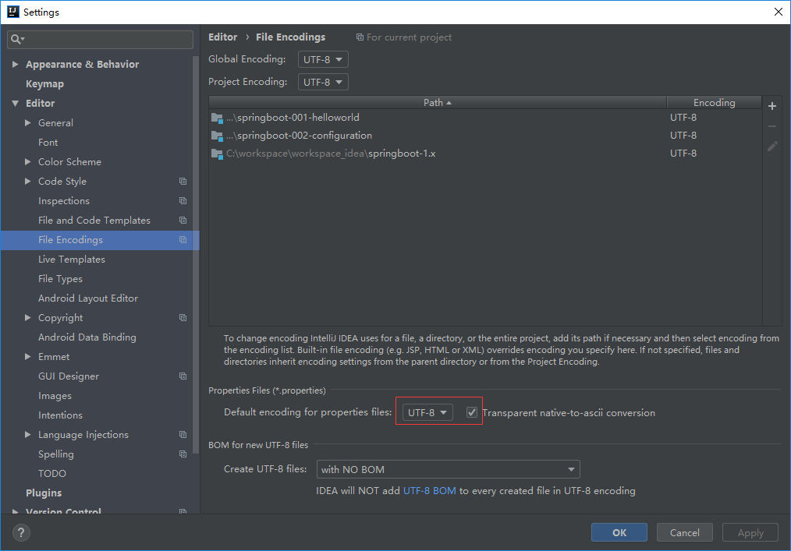

# 1､配置文件

SpringBoot使用一个全局的配置文件，配置文件名是固定的

application.properties
application.yml

配置文件放在 src/main/resources目录 或者 类路径/config 下

配置文件的作用：修改SpingBoot自动配置的默认值;SpringBoot在底层都给我们自动配置好

yml是YAM(YAML Ain't Markup Language)语言的文，以数据为中心，比json、xml等更适合做配置文件
​        YAML A Markup Languag：是一个标记语言
​        YAML isn't Markup Languag：不是一个标记语言

标记语言：
​        以前的配置文件：大多都使用的是 xxx.xml文件
​        YAML：以数据为中心，比json、xml等更适合做配置文件

​	YAML配置例子: 文件名可以为 application.yml 或者 application.yaml

```yaml
server:
   port: 8081
```

​	XML配置例子

```xml
<server>
    <port>8081</port>
</server>
```

# 2､YMAL语法

## 1､基本语法

k: v ：表示一对键值对（值前面的空格必须有）

以空格的缩进来控制层级关系；只要是左对齐的一列数据都是同一个层级的

```yaml
server:
	port: 8081
	path: /helloworld
```

属性和值也是大小写敏感

## 2､值的写法

#### 字面量：普通的值(数字、字符串、布尔)

​	k: v ：字面直接来写

​		   字符串默认不用加上单引号或者双引号

​		   ""：双引号，不会转义字符串里面的特殊字符，特殊字符会作为想表示的意思 

​			name: "zhangsan \n lisi" 输出：zhangsan 换行 lisi

​		  ''：单引号，会转义特殊字符，特殊字符最终只是一个普通的字符串数据

​			name: 'zhangsan \n lisi' 输出：zhangsan \n lisi			

#### 对象、Map（属性和值）（键值对）：

​	k: v ：在下一行来写对象的属性和值的关系，注意缩进

​		对象还是k: v的方式

​		

```yaml
friends:
	lastName: zhangsan
	age: 20
```

行内写法：

```yaml
friends: {lastName: zhangsan, age: 20}
```


####数组（List、Set）：

用-值表示数组中的一个元素

```yaml
pets:
	- cat
	- dog
	- pig
```

行内写法：

```yaml
pets: [cat, dog, pig]
```

# 3､配置文件值注入

配置文件:

```yaml
person:
  lastName: zhangsan
  age: 18
  boss: false
  birth: 2018/12/12
  maps: {k1: v1, K2: 12}
  lists:
    - lisi
    - zhaoliu
  dog:
    name: 小狗
    age: 2
```

javaBean：

```java
/**
 * 将配置文件中配置的每一个属性的值，映射到组件中
 *
 * @ConfigurationProperties：告诉springBoot将本类中的所有属性和配置文件中相关的配置进行绑定
 *      prefix = "person"：配置文件中哪个下面的所有属性进行一一遇射
 *
 *
 *  只有这个组件是容器中的组件，才能使用容器提供的@ConfigurationProperties功能
 */
@Component
@ConfigurationProperties(prefix = "person")
public class Person {

	private String lastName;
	private Integer age;
	private Boolean boss;
	private Date birth;
	private Map<String, Object> maps;
	private List<Object> lists;
	private Dog dog;
}
```

@Value获取值

```java
@Component
public class Person {

	/**
	 * <bean class="Person">
	 *		<property name="lastName" value="字面量/${key}从环境变量、配置文件中获取值/#{SpEL}"></property>
	 * </bean>
	 */
	@Value("${person.last-name}")
	private String lastName;
	@Value("#{11*2}")
	private Integer age;
	@Value("true")
	private Boolean boss;
	@Value("${person.birth}")
	private Date birth;
	@Value("#{${person.maps}}") // 获取map的值
	private Map<String, Object> maps;
	@Value("#{'${person.lists}'.split(',')}") // 获取list的值
	private List<Object> lists;
	// TODO 暂时不知道怎么获取值
	private Dog dog;
}
```

application.properties

```properties
person.last-name=张三
person.age=18
person.birth=2018/12/12
person.boss=false
person.maps={k1:"v1",k2:12}
person.lists=a,b,c
person.dog.name=dog
person.dog.age=2
```


导入配置文件处理器，以后编写配置就有提示了：

```xml
<dependency>
    <groupId>org.springframework.boot</groupId>
    <artifactId>spring-boot-configuration-processor</artifactId>
</dependency>
```

## 1、properties配置文件在idea中默认为UTF-8可能会乱码



## 2、@Value获取值和@ConfigurationProperties获取值比较

|                | @ConfigurationProperties | @Value     |
| -------------- | ------------------------ | ---------- |
| 功能           | 批量注入配置文件中的属性 | 一个个指定 |
| 松散绑定       | 支持                     | 不支持     |
| SpEL           | 不支持                   | 支持       |
| JSR303数据校验 | 支持                     | 不支持     |
| 复杂类型封装   | 支持                     | 不支持     |

属性名匹配规则（Relaxed binding）

person.lastName：使用标准方式

person.last-name：大写用-

person.last_name：大写用_

PERSON_LAST_NAME：推荐系统属性使用这种写法

配置文件yml还是properties都能获取到值

如果说，只是在某个业务逻辑中需要获取一下配置文件中的某项值，使用@Value

如果说，我们专门编写了一个javaBean来和配置文件进行映射，我们就直接使用@ConfigurationProperties

## 3、配置文件注入值数据检验

```java
@Component
@ConfigurationProperties(prefix = "person")
@Validated
public class Person {
	@Email // lastName必须是邮箱格式
	private String lastName;
	private Integer age;
	private Boolean boss;
	private Date birth;
	private Map<String, Object> maps;
	private List<Object> lists;
	private Dog dog;
}
```

## 4、@PropertySource&@ImportResource

@**PropertySource**：加载指定的配置文件

```java
/**
 * 将配置文件中配置的每一个属性的值，映射到组件中
 *
 * @ConfigurationProperties：告诉springBoot将本类中的所有属性和配置文件中相关的配置进行绑定
 *      prefix = "person"：配置文件中哪个下面的所有属性进行一一遇射
 *
 *
 *  只有这个组件是容器中的组件，才能使用容器提供的@ConfigurationProperties功能
 *  
 *   @ConfigurationProperties(prefix = "person") 默认从全局配置文件中获取值
 */
@Component
@ConfigurationProperties(prefix = "person")
@PropertySource(value = {"classpath:person.properties"})
public class Person {

	private String lastName;
	private Integer age;
	private Boolean boss;
	private Date birth;
	private Map<String, Object> maps;
	private List<Object> lists;
	private Dog dog;
}
```

@**ImportResource**：导入spring的配置文件，让配置文件里面的内容生效

Spring Boot里面没有Spring的配置文件，我们自己编写的配置文件，也不能自动识别，想让Spring的配置文件生效，加载进来，@**ImportResource** 标注在一个配置类上

beans.xml

```xml
<?xml version="1.0" encoding="UTF-8"?>
<beans xmlns="http://www.springframework.org/schema/beans"
       xmlns:xsi="http://www.w3.org/2001/XMLSchema-instance"
       xsi:schemaLocation="http://www.springframework.org/schema/beans http://www.springframework.org/schema/beans/spring-beans.xsd">
    <bean id="helloService" class="zzc.springboot.service.HelloService"></bean>
</beans>
```

```java
package zzc.springboot.service;

public class HelloService {
}

```

```java
@ImportResource(locations = {"classpath:beans.xml"}) // 导入spring的配置文件让其生效
@SpringBootApplication
public class Application {

    public static void main(String[] args) {
        SpringApplication.run(Application.class, args);
    }
}
```

```java
/**
 * SpringBoot单元测试
 * <p>
 * 可以在测试期间很方便的类似编码一样进行自动注入等功能
 */
@RunWith(SpringRunner.class)
@SpringBootTest
public class ApplicationTests {
	@Autowired
	ApplicationContext ioc;

	@Test
	public void testHelloService() {
		boolean b = ioc.containsBean("helloService");
		System.out.println(b);
	}
}
```

Spring Boot推荐给容器添加组件的方式，推荐使用全注释的方式：

1、配置类==》spring配置文件

2、使用@Bean给容器中添加组件

```java
/**
 * @Configuration：指明当前类是一个配置类，就是来替代之前的Spring配置文件
 *
 * 在配置文件中用<bean></bean>标签添加组件
 */
@Configuration
public class MyAppConfig {
	// 将方法的返回值添加到容器中，容器中这个组件默认的id就是方法名
	@Bean
	public HelloService helloService(){
		System.out.println("配置类@Bean给容器中添加组件了...");
		return new HelloService();
	}
}
```

```java
@SpringBootApplication
public class Application {
	public static void main(String[] args) {
		SpringApplication.run(Application.class, args);
	}
}
```

```java
@RunWith(SpringRunner.class)
@SpringBootTest
public class ApplicationTests {
	@Autowired
	ApplicationContext ioc;

	@Test
	public void testHelloService() {
		boolean b = ioc.containsBean("helloService");
		System.out.println(b);
	}
}
```

# 4、配置文件占位符

## 1、配置文件中使用随机数

```java
${random.value}、${random.int}、${random.long}、${random.int(10)}、${random.int[1024, 65536]}
```

## 2、占位符获取之前配置的值，如果没有可以使用默认值

```properties
firstname=zhang
lastname=san
fullname=${firstname}${lastname}
# 使用默认值
age=${age:18}
```


# 5、Profile

Profile是Spring对不同环境提供不同配置功能的支持，可以通过激活指定参数等方式快速切换环境

## 1、多profile文件形式

格式：application-{profile}.propreties

​	application-dev.properties、application-prod.properties

## 2、yml支持多profile文档块模式 

```yaml
spring:
	profiles:
		active: prod # profiles.avtive: 激活指定配置
---
spring:
	profiles: prod
server:
	port: 80
--- # 三个短横线分割多个profile区（文档块）
spring:
	profiles: default # profiles: default 表示未指定默认配置
server:
	port: 8080
```


## 3、激活指定profile方式

命令行 --spring.profiles.active=dev

配置文件 spring.profiles.active=dev

jvm参数 -Dspring.profiles.active=dev

# 6、配置文件加载位置

spring boot启动会扫描发下位置的application.propreties或者application.yml文件作为Spring Boot的默认配置文件

file:./config/  项目根目录下的config文件夹

file:./ 直接放在项目根目录下

classpath:/config/    src/main/resources/config

classpath:/	src/main/resources

以上是按照**优先级从高到低**的顺序，所有位置的文件都会被加载，**高优先级配置**内容会**覆盖低优先级配置**内容，所有的配置会形成互补配置

也可以通过配置spring.config.location来改变默认配置

# 7、外部配置加载顺序

Spring Boot支持多种外部配置方式，**优先级从高到低**，高优先级的配置会覆盖低优先级的配置，所有的配置会形成互补配置：

1、命令行参数

```java
java -jar xxx.jar --server.port=8081 --server.context-path=/abc
```

2、来自java:comp/env的JNDI属性

3、Java系统属性（System.getProperties()）

4、操作系统环境变量

5、RandomValuePropertySource配置的random.*属性值

6、jar包外部的application-{profile}.properties或application.yml（带spring.profile）配置文件

​	和打包出来的jar包在同一目录：

​	xxx.jar

​	application.properties

​	java -jar xxx.jar

7、jar包内部的application-{profile}.properties或application.yml（带spring.profile）配置文件

8、jar包外部的application.properties或application.yml（不带spring.profile）配置文件

9、jar包内部的application.properties或application.yml（不带spring.profile）配置文件

10、@Configuration注解类上的@PropertySource

11、通过SpringApplication.setDefaultProperties指定的默认属性

# 8、自动配置原理

[配置文件配置的属性参照](https://docs.spring.io/spring-boot/docs/1.5.17.RELEASE/reference/htmlsingle/#common-application-properties)

## 1、自动配置原理：

​	1、SpringBoot启动的时候加载主配置类，开启了自动配置功能==@EnableAutoConfiguration==

​	2、@EnableAutoConfiguration作用：

​		利用EnableAutoConfigurationImportSelector给容器导入一些组件？

​		可以查看selectImports()方法的内容：

```java
List<String> configurations = this.getCandidateConfigurations(annotationMetadata, attributes); // 获取候选的配置
```

```java
 SpringFactoriesLoader.loadFactoryNames() 
 // 扫描所有jar包类路径下的META-INF/spring.factories
 // 把扫描到的这些文件内容包装成properties对象
 // 从porperties中获取到EnableAutoConfiguration.class类（类名）对应的值，然后把他们添加到容器中
```

==将类路径下（spring-boot-autoconfigure-1.5.xx.RELEASE.jar）的META-INF/spring.factories里配置的EnableAutoConfiguration的值加入到了容器中==

```properties
# Auto Configure
org.springframework.boot.autoconfigure.EnableAutoConfiguration=\
org.springframework.boot.autoconfigure.admin.SpringApplicationAdminJmxAutoConfiguration,\
org.springframework.boot.autoconfigure.aop.AopAutoConfiguration,\
org.springframework.boot.autoconfigure.amqp.RabbitAutoConfiguration,\
org.springframework.boot.autoconfigure.batch.BatchAutoConfiguration,\
org.springframework.boot.autoconfigure.cache.CacheAutoConfiguration,\
org.springframework.boot.autoconfigure.cassandra.CassandraAutoConfiguration,\
org.springframework.boot.autoconfigure.cloud.CloudAutoConfiguration,\
org.springframework.boot.autoconfigure.context.ConfigurationPropertiesAutoConfiguration,\
org.springframework.boot.autoconfigure.context.MessageSourceAutoConfiguration,\
org.springframework.boot.autoconfigure.context.PropertyPlaceholderAutoConfiguration,\
org.springframework.boot.autoconfigure.couchbase.CouchbaseAutoConfiguration,\
org.springframework.boot.autoconfigure.dao.PersistenceExceptionTranslationAutoConfiguration,\
org.springframework.boot.autoconfigure.data.cassandra.CassandraDataAutoConfiguration,\
org.springframework.boot.autoconfigure.data.cassandra.CassandraRepositoriesAutoConfiguration,\
org.springframework.boot.autoconfigure.data.couchbase.CouchbaseDataAutoConfiguration,\
org.springframework.boot.autoconfigure.data.couchbase.CouchbaseRepositoriesAutoConfiguration,\
org.springframework.boot.autoconfigure.data.elasticsearch.ElasticsearchAutoConfiguration,\
org.springframework.boot.autoconfigure.data.elasticsearch.ElasticsearchDataAutoConfiguration,\
org.springframework.boot.autoconfigure.data.elasticsearch.ElasticsearchRepositoriesAutoConfiguration,\
org.springframework.boot.autoconfigure.data.jpa.JpaRepositoriesAutoConfiguration,\
org.springframework.boot.autoconfigure.data.ldap.LdapDataAutoConfiguration,\
org.springframework.boot.autoconfigure.data.ldap.LdapRepositoriesAutoConfiguration,\
org.springframework.boot.autoconfigure.data.mongo.MongoDataAutoConfiguration,\
org.springframework.boot.autoconfigure.data.mongo.MongoRepositoriesAutoConfiguration,\
org.springframework.boot.autoconfigure.data.neo4j.Neo4jDataAutoConfiguration,\
org.springframework.boot.autoconfigure.data.neo4j.Neo4jRepositoriesAutoConfiguration,\
org.springframework.boot.autoconfigure.data.solr.SolrRepositoriesAutoConfiguration,\
org.springframework.boot.autoconfigure.data.redis.RedisAutoConfiguration,\
org.springframework.boot.autoconfigure.data.redis.RedisRepositoriesAutoConfiguration,\
org.springframework.boot.autoconfigure.data.rest.RepositoryRestMvcAutoConfiguration,\
org.springframework.boot.autoconfigure.data.web.SpringDataWebAutoConfiguration,\
org.springframework.boot.autoconfigure.elasticsearch.jest.JestAutoConfiguration,\
org.springframework.boot.autoconfigure.freemarker.FreeMarkerAutoConfiguration,\
org.springframework.boot.autoconfigure.gson.GsonAutoConfiguration,\
org.springframework.boot.autoconfigure.h2.H2ConsoleAutoConfiguration,\
org.springframework.boot.autoconfigure.hateoas.HypermediaAutoConfiguration,\
org.springframework.boot.autoconfigure.hazelcast.HazelcastAutoConfiguration,\
org.springframework.boot.autoconfigure.hazelcast.HazelcastJpaDependencyAutoConfiguration,\
org.springframework.boot.autoconfigure.info.ProjectInfoAutoConfiguration,\
org.springframework.boot.autoconfigure.integration.IntegrationAutoConfiguration,\
org.springframework.boot.autoconfigure.jackson.JacksonAutoConfiguration,\
org.springframework.boot.autoconfigure.jdbc.DataSourceAutoConfiguration,\
org.springframework.boot.autoconfigure.jdbc.JdbcTemplateAutoConfiguration,\
org.springframework.boot.autoconfigure.jdbc.JndiDataSourceAutoConfiguration,\
org.springframework.boot.autoconfigure.jdbc.XADataSourceAutoConfiguration,\
org.springframework.boot.autoconfigure.jdbc.DataSourceTransactionManagerAutoConfiguration,\
org.springframework.boot.autoconfigure.jms.JmsAutoConfiguration,\
org.springframework.boot.autoconfigure.jmx.JmxAutoConfiguration,\
org.springframework.boot.autoconfigure.jms.JndiConnectionFactoryAutoConfiguration,\
org.springframework.boot.autoconfigure.jms.activemq.ActiveMQAutoConfiguration,\
org.springframework.boot.autoconfigure.jms.artemis.ArtemisAutoConfiguration,\
org.springframework.boot.autoconfigure.flyway.FlywayAutoConfiguration,\
org.springframework.boot.autoconfigure.groovy.template.GroovyTemplateAutoConfiguration,\
org.springframework.boot.autoconfigure.jersey.JerseyAutoConfiguration,\
org.springframework.boot.autoconfigure.jooq.JooqAutoConfiguration,\
org.springframework.boot.autoconfigure.kafka.KafkaAutoConfiguration,\
org.springframework.boot.autoconfigure.ldap.embedded.EmbeddedLdapAutoConfiguration,\
org.springframework.boot.autoconfigure.ldap.LdapAutoConfiguration,\
org.springframework.boot.autoconfigure.liquibase.LiquibaseAutoConfiguration,\
org.springframework.boot.autoconfigure.mail.MailSenderAutoConfiguration,\
org.springframework.boot.autoconfigure.mail.MailSenderValidatorAutoConfiguration,\
org.springframework.boot.autoconfigure.mobile.DeviceResolverAutoConfiguration,\
org.springframework.boot.autoconfigure.mobile.DeviceDelegatingViewResolverAutoConfiguration,\
org.springframework.boot.autoconfigure.mobile.SitePreferenceAutoConfiguration,\
org.springframework.boot.autoconfigure.mongo.embedded.EmbeddedMongoAutoConfiguration,\
org.springframework.boot.autoconfigure.mongo.MongoAutoConfiguration,\
org.springframework.boot.autoconfigure.mustache.MustacheAutoConfiguration,\
org.springframework.boot.autoconfigure.orm.jpa.HibernateJpaAutoConfiguration,\
org.springframework.boot.autoconfigure.reactor.ReactorAutoConfiguration,\
org.springframework.boot.autoconfigure.security.SecurityAutoConfiguration,\
org.springframework.boot.autoconfigure.security.SecurityFilterAutoConfiguration,\
org.springframework.boot.autoconfigure.security.FallbackWebSecurityAutoConfiguration,\
org.springframework.boot.autoconfigure.security.oauth2.OAuth2AutoConfiguration,\
org.springframework.boot.autoconfigure.sendgrid.SendGridAutoConfiguration,\
org.springframework.boot.autoconfigure.session.SessionAutoConfiguration,\
org.springframework.boot.autoconfigure.social.SocialWebAutoConfiguration,\
org.springframework.boot.autoconfigure.social.FacebookAutoConfiguration,\
org.springframework.boot.autoconfigure.social.LinkedInAutoConfiguration,\
org.springframework.boot.autoconfigure.social.TwitterAutoConfiguration,\
org.springframework.boot.autoconfigure.solr.SolrAutoConfiguration,\
org.springframework.boot.autoconfigure.thymeleaf.ThymeleafAutoConfiguration,\
org.springframework.boot.autoconfigure.transaction.TransactionAutoConfiguration,\
org.springframework.boot.autoconfigure.transaction.jta.JtaAutoConfiguration,\
org.springframework.boot.autoconfigure.validation.ValidationAutoConfiguration,\
org.springframework.boot.autoconfigure.web.DispatcherServletAutoConfiguration,\
org.springframework.boot.autoconfigure.web.EmbeddedServletContainerAutoConfiguration,\
org.springframework.boot.autoconfigure.web.ErrorMvcAutoConfiguration,\
org.springframework.boot.autoconfigure.web.HttpEncodingAutoConfiguration,\
org.springframework.boot.autoconfigure.web.HttpMessageConvertersAutoConfiguration,\
org.springframework.boot.autoconfigure.web.MultipartAutoConfiguration,\
org.springframework.boot.autoconfigure.web.ServerPropertiesAutoConfiguration,\
org.springframework.boot.autoconfigure.web.WebClientAutoConfiguration,\
org.springframework.boot.autoconfigure.web.WebMvcAutoConfiguration,\
org.springframework.boot.autoconfigure.websocket.WebSocketAutoConfiguration,\
org.springframework.boot.autoconfigure.websocket.WebSocketMessagingAutoConfiguration,\
org.springframework.boot.autoconfigure.webservices.WebServicesAutoConfiguration
```

每一个这样的xxxAutoConfiguration类都是容器中的一个组件，都加入到容器中，用他们来做自配置

​	3、每一个自动配置类进行自动配置功能

​	4、以**HttpEncodingAutoConfiguration（http编码自动配置）**为例解释自动配置原理

```java
@Configuration // 表示这是一个配置类，以前编写的配置文件一样，也可以给容器中添加组件
@EnableConfigurationProperties({HttpEncodingProperties.class}) // 启用指定类的ConfigurationProperties功能，将配置文件中对应的值和HttpEncodingProperties绑定起来，并把HttpEncodingProperties加入到IOC容器中
@ConditionalOnWebApplication // spring底层@Conditional注解，根据不同的条件，如果满足指定的条件，整个配置类里面的配置就会生效， 判断当前应用是否是web应用
@ConditionalOnClass({CharacterEncodingFilter.class}) // 判断当前项目有没有这个类，CharacterEncodingFilter 是SpringMVC中进行乱码解决的过滤器
@ConditionalOnProperty(
    prefix = "spring.http.encoding",
    value = {"enabled"},
    matchIfMissing = true
) // 判断配置文件中是否存在某个配置 spring.http.encoding.enabled，如果不存在，判断也是成立的，即使配置文件中不配置spring.http.encoding.enabled=true，也是默认生效的
public class HttpEncodingAutoConfiguration {
    private final HttpEncodingProperties properties; // 已经和SpringBoot的配置文件映射了
    
    // 只有一个有参构造器的情况下，参数的值就会从容器中拿
    public HttpEncodingAutoConfiguration(HttpEncodingProperties properties) {
        this.properties = properties;
    }
    
   	@Bean // 给容器中添加一个组件，这个组件的某些值需要从properties中获取
    @ConditionalOnMissingBean({CharacterEncodingFilter.class})
    public CharacterEncodingFilter characterEncodingFilter() {
        CharacterEncodingFilter filter = new OrderedCharacterEncodingFilter();
        filter.setEncoding(this.properties.getCharset().name());
        filter.setForceRequestEncoding(this.properties.shouldForce(Type.REQUEST));
        filter.setForceResponseEncoding(this.properties.shouldForce(Type.RESPONSE));
        return filter;
    }	
}
```

根据当前不同的条件判断，决定这个配置类是否生效，一旦这个配置类生效，这个配置类就会给容器中添加各种组件，这些组件的属性是从对应的properties中获取的，这些类里面的每一个属性又置文件绑定的

​	5、所有在配置文件中能配置的属性都是在xxxProperties类中封装的，配置文件能配置什么就可以参照某个功能对应的这个属性类

```java
@ConfigurationProperties(prefix = "spring.http.encoding") // 从配置文件中获取指定的值和bean的属性进行绑定
public class HttpEncodingProperties {
    public static final Charset DEFAULT_CHARSET = Charset.forName("UTF-8");
}
```

精髓：

​	1、SpringBoot启动会加载大量的自动配置类

​	2、我们看我们需要的功能有没有SpringBoot写好的自动配置类

​	3、我们再来看这个自动配置类中到底配置了哪些组件 （只要我们要用的组件有我们就不需要再来配置了）

​	4、给容器中自动配置类添加组件的时候，会从propreties类中获取某些属，我们就可以在配置文件中指定这些属性的值

xxxAutoConfiguration：自动配置类，给容器中添加组件

xxxProperties：封装配置文件中相关属性

## 2、细节

### 	1、@Conditional派生注解（Spring注解版原生的@Conditional作用）

​		作用：必须是@Conditional指定的条件成立，才给容器中添加组件，配置类里面的所有内容才生效

| @Conditional扩展注解            | 作用（判断是否满足当前指定条件）                 |
| ------------------------------- | ------------------------------------------------ |
| @ConditionalOnJava              | 系统的java版本是否符合要求                       |
| @ConditionalOnBean              | 容器中存在指定Bean                               |
| @ConditionalOnMissingBean       | 容器中不存在指定Bean                             |
| @ConditionalOnExpression        | 满足SpEL表达式指定                               |
| @ConditionalOnClass             | 系统中有指定的类                                 |
| @ConditionalOnMissingClass      | 系统中没有指定的类                               |
| @ConditionalOnSingleCandidate   | 容器中只有一个指定的Bean，或者这个Bean是首选Bean |
| @ConditionalOnProperty          | 系统中指定的属性是否有指定的值                   |
| @ConditionalOnResource          | 类路径下是否存在指定资源文件                     |
| @ConditionalOnWebApplication    | 当前是web环境                                    |
| @ConditionalOnNotWebApplication | 当前不是web环境                                  |
| @ConditionalOnJndi              | JNDI存在指定项                                   |

**自动配置类必须在一定的条件下才能生效**

我们怎么知道哪些自动配置类生效？下面讲解

### 2、Debug模式

#### 1、定义

​	我们怎么知道哪些自动配置类生效了，哪些没生效呢？怎么调试呢？运用SpringBoot提供的debug可以清晰的发现。

#### 2、步骤

##### 	2.1、配置文件(application.properties)

```properties
debug=true
```

##### 	2.2、启动类

```java
=========================
AUTO-CONFIGURATION REPORT
=========================


Positive matches: （自动配置类启用的）
-----------------

   DispatcherServletAutoConfiguration matched:
      - @ConditionalOnClass found required class 'org.springframework.web.servlet.DispatcherServlet'; @ConditionalOnMissingClass did not find unwanted class (OnClassCondition)
      - @ConditionalOnWebApplication (required) found StandardServletEnvironment (OnWebApplicationCondition)

Negative matches:（没有启动，没有匹配成功的自动配置类）
-----------------

   ActiveMQAutoConfiguration:
      Did not match:
         - @ConditionalOnClass did not find required classes 'javax.jms.ConnectionFactory', 'org.apache.activemq.ActiveMQConnectionFactory' (OnClassCondition)
```

主要两大部分：**Positive matches**:（自动配置类启用的）和**Negative matches**:（没有启动，没有匹配成功的自动配置类）。

默认配置启动的时候，会发现HttpEncodingAutoConfiguration类在Positive matches:中出现。

若配置了：spring.http.encoding.enabled=false;

则会发现HttpEncodingAutoConfiguration类在Negative matches:中出现。

这样就很完美的能发现出我们的配置类到底生效没生效。