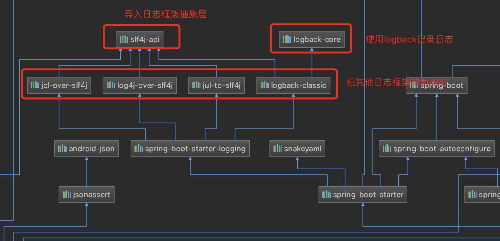
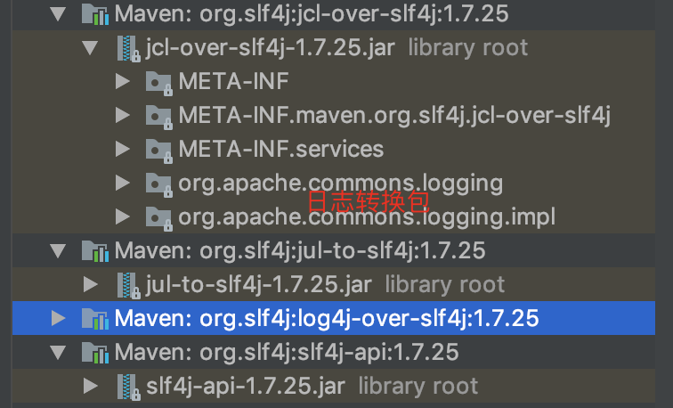
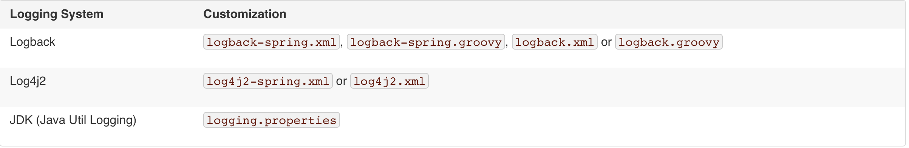

# 1､日志框架

SpringBoot选用slf4j和logback

# 2､slf4j使用

## 	1､如何在系统中使用slf4j

​			以后在开发的时候，日志记录方法的调用，不应该直接调用日志的实现类，而是调用日志抽象层的方法，导入slf4j.jar 和 logback.jar​		

```java
import org.slf4j.Logger;
import org.slf4j.LoggerFactory;

public class HelloWorld {
  public static void main(String[] args) {
    Logger logger = LoggerFactory.getLogger(HelloWorld.class);
    logger.info("Hello World");
  }
}
```

图示：


每一个日志实现框架都有自己的配置文件，使用slf4j后，**配置文件还是用日志实现框架自己本身的配置文件**

## 2､遗留问题

（slf4j+logback： spring(common-loggin)、Hibernate(jboss-logging)、mybaits(xxx)

统一日志记录：即使是别的框架也一起统一使用slf4j进行输出，

图示：


**如何让系统中所有日志都统一到slf4j：**

1、将系统中其他日志框架先排除

2､用中间包来替换原有的日志框架

3､导入slf4j其他的实现

## 3､SpringBoot日志关系

```xml
 <dependency>
 	<groupId>org.springframework.boot</groupId>
    <artifactId>spring-boot-starter</artifactId>
</dependency>
```

SpringBoot使用它来做日志功能：

```xml
<dependency>
    <groupId>org.springframework.boot</groupId>
    <artifactId>spring-boot-starter-logging</artifactId>
</dependency>
```

底层依赖关系：



总结：

​	1､SpringBoot底层也是使用slf4j+logback的方式进行日志记录

​	2､SpringBoot也把其他的日志都替换成了slf4j

​	3､什么是中间替换包?

```java
@SuppressWarnings("rawtypes")
public abstract class LogFactory {

    static String UNSUPPORTED_OPERATION_IN_JCL_OVER_SLF4J = "http://www.slf4j.org/codes.html#unsupported_operation_in_jcl_over_slf4j";

    static LogFactory logFactory = new SLF4JLogFactory();
}
```



​	4､如果要引入其他日志框架，一定要把这个框架的默认日志依赖移除掉

​		spring框架用的是common-logging：

```xml 
<dependency>
    <groupId>org.springframework</groupId>
    <artifactId>spring-core</artifactId>
    <exclusions>
        <exclusion>
            <groupId>commons-logging</groupId>
            <artifactId>commons-logging</artifactId>
        </exclusion>
    </exclusions>
</dependency>
```

​		**SpringBoot能自动适配所有的日志，而且底层使用slf4j+logback的方式，引入其他框架时，只需要把这个框架依赖的日志框架排除掉**

## 	4､日志使用

### 	1､默认配置

```java
import org.junit.Test;
import org.junit.runner.RunWith;
import org.slf4j.Logger;
import org.slf4j.LoggerFactory;
import org.springframework.boot.test.context.SpringBootTest;
import org.springframework.test.context.junit4.SpringRunner;

@RunWith(SpringRunner.class)
@SpringBootTest
public class ApplicationTests {
	// 记录器
	Logger logger = LoggerFactory.getLogger(getClass());

	@Test
	public void testLogging() {
		// 日志的级别（由低到高）：trace<debug<info<warn<error 可以调整输出的日志级别，日志就只会在这个级别及高级别的生效
		logger.trace("trace");
		logger.debug("debug");
		// SpringBoot默认日志级别为：info，没有指定级别的就用SpringBoot默认级别，root级别
		logger.info("info");
		logger.warn("warn");
		logger.error("error");
	}

}
```

SpringBoot修改默认日志配置application.properties：

```properties
# 指定包日志输出级别
logging.level.zzc.springboot=trace

# 不指定路径在当前项目下生成springboot.log，可以指定完整的路径
logging.file=springboot.log

# 指定生成日志文件生成目录
# 在当前磁盘的根路径下创建spring及log子文件夹，如没配置logging.file使用spring.log作为默认文件
logging.path=/spring/log

# 在控制台输出的日志格式
# 日志输出格式 %d：表示日期 %thread：表示线程名 %-5level：级别从左显示5个字符宽度
# %logger{50}：表示logger名字最长50个字符，否则按照句点分割
# %msg：日志消息 %n：换行符
logging.pattern.console=%d{yyyy-MM-dd HH:mm:ss} [%thread] %-5level %logger{50} - %msg%n

# 指定文件中日志输出的格式
logging.pattern.file=
```

### 2､指定配置

​	给类路径下放上每个日志框架自己的配置文件即可，SpringBoot就不使用他默认配置的了



logback.xml：直接被日志框架识别

logback-spring.xml：SpringBoot推荐使用，日志框架就不直接加载日志的配置项，由SpringBoot解析日志配置，可以使用SpringBoot的高级Profile功能

```xml
<springProfile name="staging">
    <!-- configuration to be enabled when the "staging" profile is active -->
    <!-- 可以指定某段配置只在某个环境环境下生效 -->
</springProfile>

<springProfile name="dev, staging">
    <!-- configuration to be enabled when the "dev" or "staging" profiles are active -->
</springProfile>

<springProfile name="!production">
    <!-- configuration to be enabled when the "production" profile is not active -->
</springProfile>
```

如果不是logback-spring.xml配置了springProfile会报错：no applicable(适当的；可应用的)  action for [springProfile]

```xml 
<appender name="stdout" class="ch.qos.logback.core.ConsoleAppender">

        <layout class="ch.qos.logback.classic.PatternLayout">
            <springProfile name="dev">
                <pattern>%d{yyyy/MM/dd-HH:mm:ss} %-5level [%thread] %caller{1} - %msg%n</pattern>
            </springProfile>

            <springProfile name="!dev">
                <pattern>%d{yyyy-MM-dd HH:mm:ss} [%thread] %-5level %logger{50} - %msg%n</pattern>
            </springProfile>
        </layout>
    </appender>
```

## 5､切换日志框

### 	1､使用log4j

​	

```xml
<dependency>
    <groupId>org.springframework.boot</groupId>
    <artifactId>spring-boot-starter-web</artifactId>
    <exclusions>
        <!-- 使用log4j 需要忽略自带的日志框架 -->
        <exclusion>
            <artifactId>log4j-over-slf4j</artifactId>
            <groupId>org.slf4j</groupId>
        </exclusion>
        <exclusion>
            <groupId>org.springframework.boot</groupId>
            <artifactId>spring-boot-starter-logging</artifactId>
        </exclusion>
    </exclusions>
</dependency>

<dependency>
    <groupId>org.springframework.boot</groupId>
    <artifactId>spring-boot-starter-log4j</artifactId>
    <version>1.3.8.RELEASE</version>
</dependency>
```

日志配置文件为log4j.properties

```properties
log4j.rootLogger=INFO, stdout, file
log4j.appender.stdout=org.apache.log4j.ConsoleAppender
log4j.appender.stdout.layout=org.apache.log4j.PatternLayout
log4j.appender.stdout.layout.ConversionPattern=[%p] %-d{yyyy-MM-dd HH:mm:ss} %C.%M() (%F:%L): %m%n

log4j.appender.file=org.apache.log4j.FileAppender
log4j.appender.file.File=./logs/log4j.log
log4j.appender.file.layout=org.apache.log4j.PatternLayout
log4j.appender.file.layout.ConversionPattern=[%p] %-d{yyyy-MM-dd HH:mm:ss} %C.%M() (%F:%L): %m%n
```


### 		2､使用log4j2

```xml
<dependency>
    <groupId>org.springframework.boot</groupId>
    <artifactId>spring-boot-starter-web</artifactId>
    <exclusions><!-- 去掉默认配置 -->
        <exclusion>
            <groupId>org.springframework.boot</groupId>
            <artifactId>spring-boot-starter-logging</artifactId>
        </exclusion>
    </exclusions>
</dependency>

<!-- 引入log4j2依赖 -->
<dependency> 
    <groupId>org.springframework.boot</groupId>
    <artifactId>spring-boot-starter-log4j2</artifactId>
</dependency>
```

日志配置文件为log4j2-spring.mxl

```xml
<?xml version="1.0" encoding="UTF-8"?>
<!--设置log4j2的自身log级别为warn -->
<!--日志级别以及优先级排序: OFF > FATAL > ERROR > WARN > INFO > DEBUG > TRACE > ALL -->
<!--Configuration后面的status，这个用于设置log4j2自身内部的信息输出，可以不设置， 当设置成trace时，你会看到log4j2内部各种详细输出 -->
<!--monitorInterval：Log4j能够自动检测修改配置 文件和重新配置本身，设置间隔秒数 -->
<configuration status="warn" monitorInterval="30">
	<!--先定义所有的appender -->
	<appenders>
		<!--这个输出控制台的配置 -->
		<console name="Console" target="SYSTEM_OUT">
			<!--输出日志的格式 -->
			<PatternLayout
				pattern="[%d{HH:mm:ss:SSS}] [%p] - %l - %m%n" />
		</console>
		<!--文件会打印出所有信息，这个log每次运行程序会自动清空，由append属性决定，这个也挺有用的，适合临时测试用 -->
		<File name="log" fileName="./logs/test.log" append="false">
			<PatternLayout
				pattern="%d{HH:mm:ss.SSS} %-5level %class{36} %L %M - %msg%xEx%n" />
		</File>
		<!-- 这个会打印出所有的info及以下级别的信息，每次大小超过size， 则这size大小的日志会自动存入按年份-月份建立的文件夹下面并进行压缩，作为存档 -->
		<RollingFile name="RollingFileInfo"
			fileName="./logs/info.log"
			filePattern="./logs/$${date:yyyy-MM}/info-%d{yyyy-MM-dd}-%i.log">
			<Filters>
				<!--控制台只输出level及以上级别的信息（onMatch），其他的直接拒绝（onMismatch） -->
				<ThresholdFilter level="INFO" onMatch="ACCEPT"
					onMismatch="DENY" />
				<ThresholdFilter level="WARN" onMatch="DENY"
					onMismatch="NEUTRAL" />
			</Filters>
			<PatternLayout
				pattern="[%d{HH:mm:ss:SSS}] [%p] - %l - %m%n" />
			<Policies>
				<TimeBasedTriggeringPolicy />
				<SizeBasedTriggeringPolicy size="100 MB" />
			</Policies>
		</RollingFile>

		<RollingFile name="RollingFileWarn"
			fileName="./logs/warn.log"
			filePattern="./logs/$${date:yyyy-MM}/warn-%d{yyyy-MM-dd}-%i.log">
			<Filters>
				<ThresholdFilter level="WARN" onMatch="ACCEPT"
					onMismatch="DENY" />
				<ThresholdFilter level="ERROR" onMatch="DENY"
					onMismatch="NEUTRAL" />
			</Filters>
			<PatternLayout
				pattern="[%d{HH:mm:ss:SSS}] [%p] - %l - %m%n" />
			<Policies>
				<TimeBasedTriggeringPolicy />
				<SizeBasedTriggeringPolicy size="100 MB" />
			</Policies>
			<!-- DefaultRolloverStrategy属性如不设置，则默认为最多同一文件夹下7个文件，这里设置了20 -->
			<DefaultRolloverStrategy max="20" />
		</RollingFile>

		<RollingFile name="RollingFileError"
			fileName="./logs/error.log"
			filePattern="./logs/$${date:yyyy-MM}/error-%d{yyyy-MM-dd}-%i.log">
			<ThresholdFilter level="ERROR" />
			<PatternLayout
				pattern="[%d{HH:mm:ss:SSS}] [%p] - %l - %m%n" />
			<Policies>
				<TimeBasedTriggeringPolicy />
				<SizeBasedTriggeringPolicy size="100 MB" />
			</Policies>
		</RollingFile>

	</appenders>
	<!--然后定义logger，只有定义了logger并引入的appender，appender才会生效 -->
	<loggers>
		<!--过滤掉spring和hibernate的一些无用的debug信息 -->
		<logger name="org.springframework" level="INFO">
		</logger>
		<logger name="org.mybatis" level="INFO">
		</logger>
		<root level="all">
			<appender-ref ref="Console" />
			<appender-ref ref="RollingFileInfo" />
			<appender-ref ref="RollingFileWarn" />
			<appender-ref ref="RollingFileError" />
		</root>
	</loggers>

</configuration>
```


# logback常用配置详解

## 	1､configuration 和 logger

### 		1､根节点configuration包含的属性

​				scan：当此属性设置为true时，配置文件如果发生改变，将会被重新加载，默认值为true。

​				scanPeriod：设置监测配置文件是否有修改的时间间隔，如果没有给出时间单位，默认单位是毫秒。当scan为true时，此属性生效。默认的时间间隔为1分钟。

​				debug：当此属性设置为true时，将打印出logback内部日志信息，实时查看logback运行状态。默认值为false。

​				例如：

```xml 
<configuration scan="true" scanPeriod="60 seconds" debug="false">  
      <!-- 其他配置省略-->  
</configuration>
```

### 		2､根节点configuration的子节点

​					

#### 				1､设置上下文名称contextName：

​						每个logger都关联到logger上下文，默认上下文名称为“default”。但可以使用<contextName>设置成其他名字，用于区分不同应用程序的记录。一旦设置，不能修改。		

```xml 
<configuration scan="true" scanPeriod="60 seconds" debug="false">  
      <contextName>myAppName</contextName>  
      <!-- 其他配置省略-->  
</configuration>  
```

#### 				2､设置变量property：

​						用来定义变量值的标签，<property> 有两个属性，name和value；其中name的值是变量的名称，value的值时变量定义的值。通过<property>定义的值会被插入到logger上下文中。定义变量后，可以使“${}”来使用变量。

​						例如使用<property>定义上下文名称，然后在<contentName>设置logger上下文时使用。

```xml 
<configuration scan="true" scanPeriod="60 seconds" debug="false">  
      <property name="APP_Name" value="myAppName" />   
      <contextName>${APP_Name}</contextName>  
      <!-- 其他配置省略-->  
</configuration> 
```

#### 				3､获取时间戳字符串timestamp：

​						两个属性 key:标识此**<timestamp>** 的名字；datePattern：设置将当前时间（解析配置文件的时间）转换为字符串的模式，遵循java.txt.SimpleDateFormat的格式。

​       						 例如将解析配置文件的时间作为上下文名称：

```xml 
<configuration scan="true" scanPeriod="60 seconds" debug="false">  
      <timestamp key="bySecond" datePattern="yyyyMMdd'T'HHmmss"/>   
      <contextName>${bySecond}</contextName>  
      <!-- 其他配置省略-->  
</configuration> 
```

#### 					4､设置loger：

<loger>
用来设置某一个包或者具体的某一个类的日志打印级别、以及指定<appender>。<loger>仅有一个name属性，一个可选的level和一个可选的addtivity属性。
name:
用来指定受此loger约束的某一个包或者具体的某一个类。
level:
用来设置打印级别，大小写无关：TRACE, DEBUG, INFO, WARN, ERROR, ALL 和 OFF，还有一个特俗值INHERITED或者同义词NULL，代表强制执行上级的级别。
如果未设置此属性，那么当前loger将会继承上级的级别。
addtivity:
是否向上级loger传递打印信息。默认是true。
<loger>可以包含零个或多个<appender-ref>元素，标识这个appender将会添加到这个loger。

<root>
也是<loger>元素，但是它是根loger。只有一个level属性，应为已经被命名为"root".
level:
用来设置打印级别，大小写无关：TRACE, DEBUG, INFO, WARN, ERROR, ALL 和 OFF，不能设置为INHERITED或者同义词NULL。
默认是DEBUG。
<root>可以包含零个或多个<appender-ref>元素，标识这个appender将会添加到这个loger。

```java
package logback;

import org.slf4j.Logger;
import org.slf4j.LoggerFactory;

public class LogbackDemo{
    private static Logger log = LoggerFactory.getLogger(LogbackDemo.class);
    public static void main(String[]args){
    	log.trace("======trace");
    	log.debug("======debug");
    	log.info("======info");
    	log.warn("======warn");
    	log.error("======error");
    }
}
```

### 3､logback.xml配置文件

#### 	1､只配置root

```xml 
<configuration>   
  <appender name="STDOUT" class="ch.qos.logback.core.ConsoleAppender">   
    <!-- encoder 默认配置为PatternLayoutEncoder -->   
    <encoder>   
      <pattern>%d{HH:mm:ss.SSS} [%thread] %-5level %logger{36} - %msg%n</pattern>   
    </encoder>   
  </appender>   
  <root level="INFO">             
    <appender-ref ref="STDOUT" />   
  </root>     
 </configuration>  
```

其中appender的配置表示打印到控制台(稍后详细讲解appender )；

<root level="INFO">将root的打印级别设置为“INFO”，指定了名字为“STDOUT”的appender。当执行logback.LogbackDemo类的main方法时，root将级别为“INFO”及大于“INFO”的日志信息交给已经配置好的名为“STDOUT”的appender处理，“STDOUT”appender将信息打印到控制台；

```xml 
13:30:38.484 [main] INFO  logback.LogbackDemo - ======info  
13:30:38.500 [main] WARN  logback.LogbackDemo - ======warn  
13:30:38.500 [main] ERROR logback.LogbackDemo - ======error 
```

#### 2､带有loger的配置，不指定级别，不指定appender

```xml 
<configuration>   
   
  <appender name="STDOUT" class="ch.qos.logback.core.ConsoleAppender">   
    <!-- encoder 默认配置为PatternLayoutEncoder -->   
    <encoder>   
      <pattern>%d{HH:mm:ss.SSS} [%thread] %-5level %logger{36} - %msg%n</pattern>   
    </encoder>   
  </appender>   
   
  <!-- logback为java中的包 -->   
  <logger name="logback"/>   
   
  <root level="DEBUG">             
    <appender-ref ref="STDOUT" />   
  </root>     
     
 </configuration>  
```

其中appender的配置表示打印到控制台(稍后详细讲解appender )；

<logger name="logback" />将控制logback包下的所有类的日志的打印，但是并没用设置打印级别，所以继承他的上级<root>的日志级别“DEBUG”；

没有设置addtivity，默认为true，将此loger的打印信息向上级传递；

没有设置appender，此loger本身不打印任何信息。

<root level="DEBUG">将root的打印级别设置为“DEBUG”，指定了名字为“STDOUT”的appender。 

当执行logback.LogbackDemo类的main方法时，因为LogbackDemo 在包logback中，所以首先执行<logger name="logback" />，将级别为“DEBUG”及大于“DEBUG”的日志信息传递给root，本身并不打印；

root接到下级传递的信息，交给已经配置好的名为“STDOUT”的appender处理，“STDOUT”appender将信息打印到控制台；

```xml
13:19:15.406 [main] DEBUG logback.LogbackDemo - ======debug  
13:19:15.406 [main] INFO  logback.LogbackDemo - ======info  
13:19:15.406 [main] WARN  logback.LogbackDemo - ======warn  
13:19:15.406 [main] ERROR logback.LogbackDemo - ======error  
```

#### 3､带有多个loger的配置，指定级别，指定appender  	

```xml 
<configuration>   
   <appender name="STDOUT" class="ch.qos.logback.core.ConsoleAppender">   
    <!-- encoder 默认配置为PatternLayoutEncoder -->   
    <encoder>   
      <pattern>%d{HH:mm:ss.SSS} [%thread] %-5level %logger{36} - %msg%n</pattern>   
    </encoder>   
  </appender>   
   
  <!-- logback为java中的包 -->   
  <logger name="logback"/>   
  <!--logback.LogbackDemo：类的全路径 -->   
  <logger name="logback.LogbackDemo" level="INFO" additivity="false">  
    <appender-ref ref="STDOUT"/>  
  </logger>   
    
  <root level="ERROR">             
    <appender-ref ref="STDOUT" />   
  </root>     
</configuration>  
```

其中appender的配置表示打印到控制台(稍后详细讲解appender )； 

<logger name="logback" />将控制logback包下的所有类的日志的打印，但是并没用设置打印级别，所以继承他的上级<root>的日志级别“DEBUG”；

没有设置addtivity，默认为true，将此loger的打印信息向上级传递；

没有设置appender，此loger本身不打印任何信息。

 <logger name="logback.LogbackDemo" level="INFO" additivity="false">控制logback.LogbackDemo类的日志打印，打印级别为“INFO”；

additivity属性为false，表示此loger的打印信息不再向上级传递，

指定了名字为“STDOUT”的appender。 

<root level="ERROR">将root的打印级别设置为“ERROR”，指定了名字为“STDOUT”的appender。

 

 当执行logback.LogbackDemo类的main方法时，先执行<logger name="logback.LogbackDemo" level="INFO" additivity="false">，将级别为“INFO”及大于“INFO”的日志信息交给此loger指定的名为“STDOUT”的appender处理，在控制台中打出日志，不再向次loger的上级 <logger name="logback"/> 传递打印信息；

<logger name="logback"/>未接到任何打印信息，当然也不会给它的上级root传递任何打印信息；

```xml
14:05:35.937 [main] INFO  logback.LogbackDemo - ======info  
14:05:35.937 [main] WARN  logback.LogbackDemo - ======warn  
14:05:35.937 [main] ERROR logback.LogbackDemo - ======error  
```

如果将<logger name="logback.LogbackDemo" level="INFO" additivity="false">修改为 <logger name="logback.LogbackDemo" level="INFO" additivity="true">那打印结果将是什么呢？

没错，日志打印了两次，想必大家都知道原因了，因为打印信息向上级传递，logger本身打印一次，root接到后又打印一次

```:american_samoa:
14:09:01.531 [main] INFO  logback.LogbackDemo - ======info  
14:09:01.531 [main] INFO  logback.LogbackDemo - ======info  
14:09:01.531 [main] WARN  logback.LogbackDemo - ======warn  
14:09:01.531 [main] WARN  logback.LogbackDemo - ======warn  
14:09:01.531 [main] ERROR logback.LogbackDemo - ======error  
14:09:01.531 [main] ERROR logback.LogbackDemo - ======error
```

## 2､appender

	

**<appender>：**

​	<appender>是<configuration>的子节点，是负责写日志的组件。

​	<appender>有两个必要属性name和class。name指定appender名称，class指定appender的全限定名。

### 1､ConsoleAppender

​	把日志添加到控制台，有以下子节点：

​	<encoder>：对日志进行格式化。（具体参数稍后讲解 ）

​	<target>：字符串 *System.out* 或者 *System.err* ，默认 *System.out* ；

```xml 
<configuration>  
  
  <appender name="STDOUT" class="ch.qos.logback.core.ConsoleAppender">  
    <encoder>  
      <pattern>%-4relative [%thread] %-5level %logger{35} - %msg %n</pattern>  
    </encoder>  
  </appender>  
  
  <root level="DEBUG">  
    <appender-ref ref="STDOUT" />  
  </root>  
</configuration>  
```

### 2､FileAppender

把日志添加到文件，有以下子节点：

<file>：被写入的文件名，可以是相对目录，也可以是绝对目录，如果上级目录不存在会自动创建，没有默认值。

<append>：如果是 true，日志被追加到文件结尾，如果是 false，清空现存文件，默认是true。

<encoder>：对记录事件进行格式化。（具体参数稍后讲解 ）

<prudent>：如果是 true，日志会被安全的写入文件，即使其他的FileAppender也在向此文件做写入操作，效率低，默认是 false。

```xml
<configuration>  
  
  <appender name="FILE" class="ch.qos.logback.core.FileAppender">  
    <file>testFile.log</file>  
    <append>true</append>  
    <encoder>  
      <pattern>%-4relative [%thread] %-5level %logger{35} - %msg%n</pattern>  
    </encoder>  
  </appender>  
          
  <root level="DEBUG">  
    <appender-ref ref="FILE" />  
  </root>  
</configuration> 
```

### 3､RollingFileAppender

滚动记录文件，先将日志记录到指定文件，当符合某个条件时，将日志记录到其他文件。有以下子节点：
<file>：被写入的文件名，可以是相对目录，也可以是绝对目录，如果上级目录不存在会自动创建，没有默认值。
<append>：如果是 true，日志被追加到文件结尾，如果是 false，清空现存文件，默认是true。
<encoder>：对记录事件进行格式化。（具体参数稍后讲解 ）
<rollingPolicy>:当发生滚动时，决定 RollingFileAppender 的行为，涉及文件移动和重命名。
<triggeringPolicy >: 告知 RollingFileAppender 合适激活滚动。
<prudent>：当为true时，不支持FixedWindowRollingPolicy。支持TimeBasedRollingPolicy，但是有两个限制，1不支持也不允许文件压缩，2不能设置file属性，必须留空。

rollingPolicy：

TimeBasedRollingPolicy： 最常用的滚动策略，它根据时间来制定滚动策略，既负责滚动也负责出发滚动。有以下子节点：
<fileNamePattern>:
必要节点，包含文件名及“%d”转换符， “%d”可以包含一个 java.text.SimpleDateFormat指定的时间格式，如：%d{yyyy-MM}。如果直接使用 %d，默认格式是 yyyy-MM-dd。 RollingFileAppender 的file字节点可有可无，通过设置file，可以为活动文件和归档文件指定不同位置，当前日志总是记录到file指定的文件（活动文件），活动文件的名字不会改变；如果没设置file，活动文件的名字会根据fileNamePattern 的值，每隔一段时间改变一次。“/”或者“\”会被当做目录分隔符。

<maxHistory>:
可选节点，控制保留的归档文件的最大数量，超出数量就删除旧文件。假设设置每个月滚动，且 <maxHistory>是6，则只保存最近6个月的文件，删除之前的旧文件。注意，删除旧文件是，那些为了归档而创建的目录也会被删除。


FixedWindowRollingPolicy： 根据固定窗口算法重命名文件的滚动策略。有以下子节点：
<minIndex>:窗口索引最小值
<maxIndex>:窗口索引最大值，当用户指定的窗口过大时，会自动将窗口设置为12。
<fileNamePattern >:
必须包含“%i”例如，假设最小值和最大值分别为1和2，命名模式为 mylog%i.log,会产生归档文件mylog1.log和mylog2.log。还可以指定文件压缩选项，例如，mylog%i.log.gz 或者 没有log%i.log.zip


triggeringPolicy:

SizeBasedTriggeringPolicy： 查看当前活动文件的大小，如果超过指定大小会告知 RollingFileAppender 触发当前活动文件滚动。只有一个节点:
<maxFileSize>:这是活动文件的大小，默认值是10MB。

例如：每天生成一个日志文件，保存30天的日志文件

```xml
<configuration>   
  <appender name="FILE" class="ch.qos.logback.core.rolling.RollingFileAppender">   
      
    <rollingPolicy class="ch.qos.logback.core.rolling.TimeBasedRollingPolicy">   
      <fileNamePattern>logFile.%d{yyyy-MM-dd}.log</fileNamePattern>   
      <maxHistory>30</maxHistory>    
    </rollingPolicy>   
   
    <encoder>   
      <pattern>%-4relative [%thread] %-5level %logger{35} - %msg%n</pattern>   
    </encoder>   
  </appender>    
   
  <root level="DEBUG">   
    <appender-ref ref="FILE" />   
  </root>   
</configuration> 
```

例如：按照固定窗口模式生成日志文件，当文件大于20MB时，生成新的日志文件。窗口大小是1到3，当保存了3个归档文件后，将覆盖最早的日志

```xml
<configuration>   
  <appender name="FILE" class="ch.qos.logback.core.rolling.RollingFileAppender">   
    <file>test.log</file>   
   
    <rollingPolicy class="ch.qos.logback.core.rolling.FixedWindowRollingPolicy">   
      <fileNamePattern>tests.%i.log.zip</fileNamePattern>   
      <minIndex>1</minIndex>   
      <maxIndex>3</maxIndex>   
    </rollingPolicy>   
   
    <triggeringPolicy class="ch.qos.logback.core.rolling.SizeBasedTriggeringPolicy">   
      <maxFileSize>5MB</maxFileSize>   
    </triggeringPolicy>   
    <encoder>   
      <pattern>%-4relative [%thread] %-5level %logger{35} - %msg%n</pattern>   
    </encoder>   
  </appender>   
           
  <root level="DEBUG">   
    <appender-ref ref="FILE" />   
  </root>   
</configuration>  
```

### 4､其他的Appender

​	另外还有SocketAppender、SMTPAppender、DBAppender、SyslogAppender、SiftingAppender，并不常用，这些就不在这里讲解了，大家可以参考官方文档。当然大家可以编写自己的Appender

encoder

​	负责两件事，一是把日志信息转换成字节数组，二是把字节数组写入到输出流。

目前**PatternLayoutEncoder** 是唯一有用的且默认的**encoder** ，有一个<pattern>节点，用来设置日志的输入格式。使用“%”加“转换符”方式，如果要输出“%”，则必须用“\”对“\%”进行转义。

```xml
<encoder>   
   <pattern>%-4relative [%thread] %-5level %logger{35} - %msg%n</pattern>   
</encoder
```

## 3､filter

<filter>:

过滤器，执行一个过滤器会有返回个枚举值，即DENY，NEUTRAL，ACCEPT其中之一。返回DENY，日志将立即被抛弃不再经过其他过滤器；返回NEUTRAL，有序列表里的下个过滤器过接着处理日志；返回ACCEPT，日志会被立即处理，不再经过剩余过滤器。

过滤器被添加到<Appender> 中，为<Appender> 添加一个或多个过滤器后，可以用任意条件对日志进行过滤。<Appender> 有多个过滤器时，按照配置顺序执行。 

下面是几个常用的过滤器：

LevelFilter： 级别过滤器，根据日志级别进行过滤。如果日志级别等于配置级别，过滤器会根据onMath 和 onMismatch接收或拒绝日志。有以下子节点：

<level>:设置过滤级别

<onMatch>:用于配置符合过滤条件的操作

<onMismatch>:用于配置不符合过滤条件的操作

例如：将过滤器的日志级别配置为INFO，所有INFO级别的日志交给appender处理，非INFO级别的日志，被过滤掉

```xml
<configuration>   
  <appender name="CONSOLE" class="ch.qos.logback.core.ConsoleAppender">   
    <filter class="ch.qos.logback.classic.filter.LevelFilter">   
      <level>INFO</level>   
      <onMatch>ACCEPT</onMatch>   
      <onMismatch>DENY</onMismatch>   
    </filter>   
    <encoder>   
      <pattern>   
        %-4relative [%thread] %-5level %logger{30} - %msg%n   
      </pattern>   
    </encoder>   
  </appender>   
  <root level="DEBUG">   
    <appender-ref ref="CONSOLE" />   
  </root>   
</configuration>  
```

**ThresholdFilter**： 临界值过滤器，过滤掉低于指定临界值的日志。当日志级别等于或高于临界值时，过滤器返回NEUTRAL；当日志级别低于临界值时，日志会被拒绝。

例如：过滤掉所有低于INFO级别的日志

```xml
<configuration>   
  <appender name="CONSOLE"   
    class="ch.qos.logback.core.ConsoleAppender">   
    <!-- 过滤掉 TRACE 和 DEBUG 级别的日志-->   
    <filter class="ch.qos.logback.classic.filter.ThresholdFilter">   
      <level>INFO</level>   
    </filter>   
    <encoder>   
      <pattern>   
        %-4relative [%thread] %-5level %logger{30} - %msg%n   
      </pattern>   
    </encoder>   
  </appender>   
  <root level="DEBUG">   
    <appender-ref ref="CONSOLE" />   
  </root>   
</configuration>  
```

EvaluatorFilter： 求值过滤器，评估、鉴别日志是否符合指定条件。需要额外的两个JAR包，commons-compiler.jar和janino.jar有以下子节点：

<evaluator>:

鉴别器，常用的鉴别器是JaninoEventEvaluato，也是默认的鉴别器，它以任意的java布尔值表达式作为求值条件，求值条件在配置文件解释过成功被动态编译，布尔值表达式返回true就表示符合过滤条件。evaluator有个子标签<expression>，用于配置求值条件。 

求值表达式作用于当前日志，logback向求值表达式暴露日志的各种字段：

Name Type Description
event	LoggingEvent	与记录请求相关联的原始记录事件，下面所有变量都来自event，例如，event.getMessage()返回下面"message"相同的字符串
message	String	日志的原始消息，例如，设有logger mylogger，"name"的值是"AUB"，对于 mylogger.info("Hello {}",name); "Hello {}"就是原始消息。
formatedMessage	String	日志被各式话的消息，例如，设有logger mylogger，"name"的值是"AUB"，对于 mylogger.info("Hello {}",name); "Hello Aub"就是格式化后的消息。
logger	String	logger 名。
loggerContext	LoggerContextVO	日志所属的logger上下文。
level	int	级别对应的整数值，所以 level > INFO 是正确的表达式。
timeStamp	long	创建日志的时间戳。
marker	Marker	与日志请求相关联的Marker对象，注意“Marker”有可能为null，所以你要确保它不能是null。
mdc	Map	包含创建日志期间的MDC所有值得map。访问方法是： mdc.get("myKey") 。mdc.get()返回的是Object不是String，要想调用String的方法就要强转，例如，
((String) mdc.get("k")).contains("val") .MDC可能为null，调用时注意。

throwable	java.lang.Throwable	如果没有异常与日志关联"throwable" 变量为 null. 不幸的是， "throwable" 不能被序列化。在远程系统上永远为null，对于与位置无关的表达式请使用下面的变量throwableProxy
throwableProxy	IThrowableProxy	与日志事件关联的异常代理。如果没有异常与日志事件关联，则变量"throwableProxy" 为 null. 当异常被关联到日志事件时，"throwableProxy" 在远程系统上不会为null


<onMatch>:用于配置符合过滤条件的操作

<onMismatch>:用于配置不符合过滤条件的操作

例如：过滤掉所有日志消息中不包含“billing”字符串的日志

```xml
<configuration>   
   
  <appender name="STDOUT" class="ch.qos.logback.core.ConsoleAppender">   
    <filter class="ch.qos.logback.core.filter.EvaluatorFilter">         
      <evaluator> <!-- 默认为 ch.qos.logback.classic.boolex.JaninoEventEvaluator -->   
        <expression>return message.contains("billing");</expression>   
      </evaluator>   
      <OnMatch>ACCEPT </OnMatch>  
      <OnMismatch>DENY</OnMismatch>  
    </filter>   
    <encoder>   
      <pattern>   
        %-4relative [%thread] %-5level %logger - %msg%n   
      </pattern>   
    </encoder>   
  </appender>   
   
  <root level="INFO">   
    <appender-ref ref="STDOUT" />   
  </root>   
</configuration>  
```

**<matcher> ：**

匹配器，尽管可以使用String类的matches()方法进行模式匹配，但会导致每次调用过滤器时都会创建一个新的Pattern对象，为了消除这种开销，可以预定义一个或多个matcher对象，定以后就可以在求值表达式中重复引用。<matcher>是<evaluator>的子标签。

<matcher>中包含两个子标签，一个是<name>，用于定义matcher的名字，求值表达式中使用这个名字来引用matcher；另一个是<regex>，用于配置匹配条件。

```xml
<configuration debug="true">   
   
  <appender name="STDOUT" class="ch.qos.logback.core.ConsoleAppender">   
    <filter class="ch.qos.logback.core.filter.EvaluatorFilter">   
      <evaluator>           
        <matcher>   
          <Name>odd</Name>   
          <!-- filter out odd numbered statements -->   
          <regex>statement [13579]</regex>   
        </matcher>   
           
        <expression>odd.matches(formattedMessage)</expression>   
      </evaluator>   
      <OnMismatch>NEUTRAL</OnMismatch>   
      <OnMatch>DENY</OnMatch>   
    </filter>   
    <encoder>   
      <pattern>%-4relative [%thread] %-5level %logger - %msg%n</pattern>   
    </encoder>   
  </appender>   
   
  <root level="DEBUG">   
    <appender-ref ref="STDOUT" />   
  </root>   
</configuration>  
```

