# 1､使用idea或sts创建SpringBoot应用

​	1､创建SpringBoot应用，选中需要的模块

​	2､SpringBoot已经默认将这些场景配置好了，只需要在配置文件中指定少量配置就可以运行起来

​	3､编写业务代码

# 2､SpringBoot对静态资源的映射规则

```java
@ConfigurationProperties(prefix = "spring.resources", ignoreUnknownFields = false)
public class ResourceProperties implements ResourceLoaderAware, InitializingBean {
	// 可以设置和资源有关的参数，缓存时间
}
```

ResourceProperties.class

```java
@Override
public void addResourceHandlers(ResourceHandlerRegistry registry) {
    if (!this.resourceProperties.isAddMappings()) {
        logger.debug("Default resource handling disabled");
        return;
    }
    Integer cachePeriod = this.resourceProperties.getCachePeriod();
    if (!registry.hasMappingForPattern("/webjars/**")) {
        customizeResourceHandlerRegistration(registry
                                             .addResourceHandler("/webjars/**")
                                             .addResourceLocations("classpath:/META-INF/resources/webjars/")
                                             .setCachePeriod(cachePeriod));
    }
    String staticPathPattern = this.mvcProperties.getStaticPathPattern();
    if (!registry.hasMappingForPattern(staticPathPattern)) {
        customizeResourceHandlerRegistration(
            registry.addResourceHandler(staticPathPattern)
            .addResourceLocations(
                this.resourceProperties.getStaticLocations())
            .setCachePeriod(cachePeriod));
    }
}

// 配置欢迎页映射
@Bean
public WelcomePageHandlerMapping welcomePageHandlerMapping(
    ResourceProperties resourceProperties) {
    return new WelcomePageHandlerMapping(resourceProperties.getWelcomePage(),
                                         this.mvcProperties.getStaticPathPattern());
}

// 配置图标
@Configuration
@ConditionalOnProperty(value = "spring.mvc.favicon.enabled", matchIfMissing = true)
public static class FaviconConfiguration {

    private final ResourceProperties resourceProperties;

    public FaviconConfiguration(ResourceProperties resourceProperties) {
        this.resourceProperties = resourceProperties;
    }

    @Bean
    public SimpleUrlHandlerMapping faviconHandlerMapping() {
        SimpleUrlHandlerMapping mapping = new SimpleUrlHandlerMapping();
        mapping.setOrder(Ordered.HIGHEST_PRECEDENCE + 1);
        // 所有**/favicon.ico
        mapping.setUrlMap(Collections.singletonMap("**/favicon.ico",
                                                   faviconRequestHandler()));
        return mapping;
    }

    @Bean
    public ResourceHttpRequestHandler faviconRequestHandler() {
        ResourceHttpRequestHandler requestHandler = new ResourceHttpRequestHandler();
        requestHandler
            .setLocations(this.resourceProperties.getFaviconLocations());
        return requestHandler;
    }

}
```


### 1､所有/webjars/**，都去classpath:/META-INF/resources/webjars/找资源

webjars：以jar包的方式引入静态资源 https://www.webjars.org

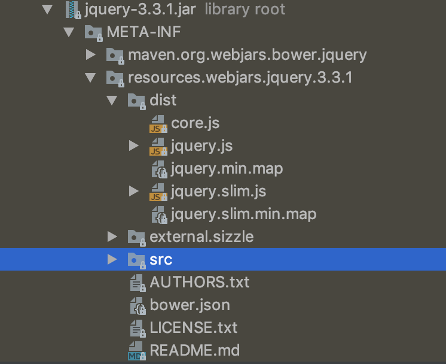

http://localhost:8080/webjars/jquery/3.3.1/jquery.js

```xml
<!-- 引入jquery-webjars 在访问的时候只需要写webjars下面的资源名称-->
<dependency>
    <groupId>org.webjars.bower</groupId>
    <artifactId>jquery</artifactId>
    <version>3.3.1</version>
</dependency>
```

### 2､/**访问当前项目的任何资源(静态资源的文件夹)

```
"classpath:/META-INF/resources/"
"classpath:/resources/"
"classpath:/static/",
"classpath:/public/"
"/" 当前项目的根路径
```

http://localhost:8080/abc*** 去静态资源文件夹里面找abc

### 3､欢迎页，静态资源文件夹下的所有index.html，被"/**"映射

http://localhost:8080/ 找index.html

### 4､所有**/favicon.ico都是在静态资源文件夹下找

```properties
# 自定义静态资源路径
spring.resources.static-locations=classpath:/first/,/seconds/
```

# 3､模板引擎

jsp、velocity、freemarker、thymeleaf：

SpringBoot推荐的thymeleaf：

语法更简单，功能更强大

### 1､引入thymeleaf

```xml
<dependency>
    <groupId>org.springframework.boot</groupId>
    <artifactId>spring-boot-starter-thymeleaf</artifactId>
</dependency>

<!-- 切换版本 -->
<properties>
    <thymeleaf.version>3.0.11.RELEASE</thymeleaf.version>
    <!-- 布局功能的支持程序 thymeleaf3主程序 layout2以上版本 -->
    <!-- thymeleaf2 layout1 -->
    <thymeleaf-layout-dialect.version>2.3.0</thymeleaf-layout-dialect.version>
</properties>
```

### 2､Thymeleaf使用&语法

```java
@ConfigurationProperties(prefix = "spring.thymeleaf")
public class ThymeleafProperties {

	private static final Charset DEFAULT_ENCODING = Charset.forName("UTF-8");

	private static final MimeType DEFAULT_CONTENT_TYPE = MimeType.valueOf("text/html");

	public static final String DEFAULT_PREFIX = "classpath:/templates/";

	public static final String DEFAULT_SUFFIX = ".html";
    // 只要把html页面放在classpath:/templates/,thymeleaf就能自动渲染
}
```

使用：

#### 1､导入thymeleaf的名称空间

```html
<html xmlns:th="http://www.thymeleaf.org">
```

#### 2､使用thymeleaf语法

```html
<!DOCTYPE html>
<html xmlns:th="http://www.thymeleaf.org">
<head>
    <meta charset="UTF-8">
    <title>success</title>
</head>
<body>
    <h1>成功!</h1>
    <!-- th:text 将div里的文本内容设置为  -->
    <div th:text="${hello}"></div>
</body>
</html>
```

#### 3､[语法规则](https://www.thymeleaf.org)

1､th:text：改变当前元素里面的文本内容

​	th:任意属性，来替换原生属性的值

# 4､SpringMVC自动配置

### 1､Spring MVC auto-configuration

SpringBoot自动配置好了Spring MVC

以下是SpringBoot对SpringMVC的默认配置:

- Inclusion of `ContentNegotiatingViewResolver` and `BeanNameViewResolver` beans.

  ​	自动配置了ViewResolver(视图解析器：根据方法的返回值得到视图对象(View)，视图对象决定如何渲染(转发？重定向？))

  ​	ContentNegotiatingViewResolver：组合所有的视图解析器的

  ​	如何定制：我们可以自己给容器中添加一个视图解析器，自动的将其组合起来

- Support for serving static resources, including support for WebJars (see below). 静态资源文件夹路径，webjars

- Automatic registration of `Converter`, `GenericConverter`, `Formatter` beans. 

  ​	     自动注册 Converter`, `GenericConverter`, `Formatter`

  ​	Converter：转换器，public String hello(User user)：类型转换使用Converter

  ​	Formatter：格式化器，2018-11-11转为date类型

  ```java
  @Bean
  @ConditionalOnProperty(prefix = "spring.mvc", name = "date-format") // 在配置文件中日期格式化规则
  public Formatter<Date> dateFormatter() {
      return new DateFormatter(this.mvcProperties.getDateFormat()); // 日期格式化组件
  }
  ```

  自己添加的格式化器转换器，只需要放在容器中即可

- Support for `HttpMessageConverters` (see below).

  ​	HttpMessageConverters：SpringMVC用来转换Http请求和响应的

  ​	HttpMessageConverters：是从容器中确定的，获取所有的HttpMessageConverters

  ​	自己给容器中添加HttpMessageConverters，只需要将自己的组件注册在容器中(@Bean，@Component)

- Automatic registration of `MessageCodesResolver` (see below).

  ​	定义错误代码生成规则的

- Static `index.html` support. 静态首页访问

- Custom `Favicon` support (see below).  favicon.ico

- Automatic use of a `ConfigurableWebBindingInitializer` bean (see below).

  ​	我们可以配置一个ConfigurableWebBindingInitializer来替换默认的(添加到容器中)

  ​	作用：

  ​		初始化WebDataBinder(请求数据-->JavaBean)

org.springframework.boot.autoconfigure.web：web的所有自动场景

If you want to keep Spring Boot MVC features, and you just want to add additional [MVC configuration](https://docs.spring.io/spring/docs/4.3.20.RELEASE/spring-framework-reference/htmlsingle#mvc) (interceptors, formatters, view controllers etc.) you can add your own `@Configuration` class of type `WebMvcConfigurerAdapter`, but **without** `@EnableWebMvc`. If you wish to provide custom instances of `RequestMappingHandlerMapping`, `RequestMappingHandlerAdapter` or `ExceptionHandlerExceptionResolver` you can declare a `WebMvcRegistrationsAdapter` instance providing such components.

If you want to take complete control of Spring MVC, you can add your own `@Configuration` annotated with `@EnableWebMvc`.

### 2､扩展SpringMVC

```xml
<mvc:view-controller path="/hello" view-name="success"/>
<mvc:interceptors>
    <mvc:interceptor>
    	<mvc:mapping path="/hello" />
        <bean></bean>
    </mvc:interceptor>
</mvc:interceptors>
```

编写一个配置类(@Configuration)，是WebMvcConfigurerAdapter类型，不能标注@EnableWebMvc

既保留了所有的自动配置，也能用我们扩展的配置

```java
/**
 * 使用WebMvcConfigurerAdapter可以扩展SpringMVC的功能
 */
@Configuration
public class MyMvcConfig extends WebMvcConfigurerAdapter {

	@Override
	public void addViewControllers(ViewControllerRegistry registry) {
		//super.addViewControllers(registry);
		// 浏览器发送 /zzc 请求来到success页面
		registry.addViewController("/zzc").setViewName("success");

	}
}
```

原理：

​	1､WebMvcAutoConfiguration是SpringMVC的自动配置类

​	2､在做其他自动配置时会导入，@Import(**EnableWebMvcConfiguration**.class)

```java
@Configuration
public static class EnableWebMvcConfiguration extends DelegatingWebMvcConfiguration {
    
    // 从容器中获取所有的WebMvcConfigurer
    @Autowired(required = false)
	public void setConfigurers(List<WebMvcConfigurer> configurers) {
		if (!CollectionUtils.isEmpty(configurers)) {
			this.configurers.addWebMvcConfigurers(configurers);
            // 一个参考实现，将所有的WebMvcConfigurer相关配置都来一起调用
            /*
            	@Override
                public void addViewControllers(ViewControllerRegistry registry) {
                    for (WebMvcConfigurer delegate : this.delegates) {
                        delegate.addViewControllers(registry);
                    }
                }
            */
		}
	}
    
}
```

​	3､容器中所有的WebMvcConfigurer都会一起起作用

​	4､我们的配置类也会被调用

​		效果：SpringMVC的自动配置和我们的扩展配置都会起作用

### 3､全面接管SpringMVC

​	SpringBoot对SpringMVC的自动配置不需要了，所有都是我们自己配置，所有的SpringMVC的自动配置都失效了

​		需要在配置类中添加@EnableWebMvc即可

```java
@EnableWebMvc
@Configuration
public class MyMvcConfig extends WebMvcConfigurerAdapter {

	@Override
	public void addViewControllers(ViewControllerRegistry registry) {
		//super.addViewControllers(registry);
		// 浏览器发送 /zzc 请求来到success页面
		registry.addViewController("/zzc").setViewName("success");

	}
}
```

原理:

​	为什么@EnableWebMvc自动配置就失效了

​	1､@EnableWebMvc的核心

```java
@Import(DelegatingWebMvcConfiguration.class)
public @interface EnableWebMvc {
}
```

​	2､

```java
@Configuration
public class DelegatingWebMvcConfiguration extends WebMvcConfigurationSupport {
}
```

​	3､

```java
@Configuration
@ConditionalOnWebApplication
@ConditionalOnClass({ Servlet.class, DispatcherServlet.class,
		WebMvcConfigurerAdapter.class })
// @ConditionalOnMissingBean 容器中没有这个组件的时候，这个自动配置类才生效
@ConditionalOnMissingBean(WebMvcConfigurationSupport.class)
@AutoConfigureOrder(Ordered.HIGHEST_PRECEDENCE + 10)
@AutoConfigureAfter({ DispatcherServletAutoConfiguration.class,
		ValidationAutoConfiguration.class })
public class WebMvcAutoConfiguration {
    
}
```

​	4､@EnableWebMvc将WebMvcConfigurationSupport组件导入进来

​	5､导入的WebMvcConfigurationSupport只是SpringMVC最基本的功能

# 5､如何修改SpringBoot的默认配置

​	模式：

​		1､SpringBoot在自动配置很多组件的时候，先看容器中有没有用户自己配置的(@Bean，@Component)，如果有就用用户自己配置的，如果没有才自动配置，如果有些组件可以有多个（ViewResolver）将用户配置的和自己默认的组合起来

​		2､在SpringBoot中会有非常多的xxxConfigurer帮助我们进行扩展配置

​		3､在SpringBoot中会有非常多的xxxCustomizer帮助我们定制配置

# 6､RestfulCRUD

### 	1､默认访问首页

```java
@Configuration
public class MyMvcConfig extends WebMvcConfigurerAdapter {
    
	// 所有的WebMvcConfigurerAdapter组件都会一起起作用
	@Bean // 将组件注册到容器中
	public WebMvcConfigurerAdapter webMvcConfigurerAdapter(){
		WebMvcConfigurerAdapter adapter = new WebMvcConfigurerAdapter() {
			@Override
			public void addViewControllers(ViewControllerRegistry registry) {
				registry.addViewController("/").setViewName("login");
				registry.addViewController("/index.html").setViewName("login");
			}
		};
		return adapter;
	}
}
```

### 	2､国际化

​		1､编辑国际化配置文件

​		2､使用ResourceBindleMessageSource管理国际化资源文件

​		3､在页面使用fmt:message取出国际化内容(jsp)

​		步骤:

​			1､编写国际化配置文件，抽取页面需要显示的国际化消息

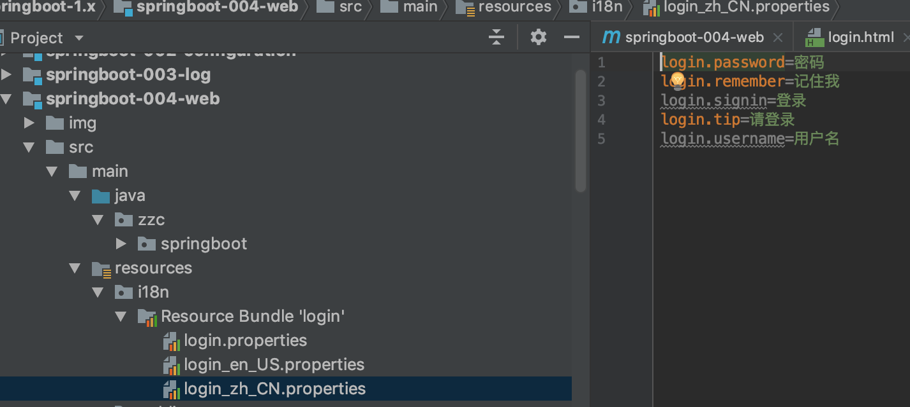

​		2､SpringBoot自动配置好了管理国际化资源文件的组件

```java
@ConfigurationProperties(prefix = "spring.messages")
public class MessageSourceAutoConfiguration {
    /**
	 * Comma-separated list of basenames (essentially a fully-qualified classpath
	 * location), each following the ResourceBundle convention with relaxed support for
	 * slash based locations. If it doesn't contain a package qualifier (such as
	 * "org.mypackage"), it will be resolved from the classpath root.
	 */
    private String basename = "messages"; // 我们的配置文件可以直接放在类路径下叫messages.properties
    
    @Bean
	public MessageSource messageSource() {
		ResourceBundleMessageSource messageSource = new ResourceBundleMessageSource();
		if (StringUtils.hasText(this.basename)) {
            // 设置国际化资源文件的基础名(去掉国家语言代码的)
			messageSource.setBasenames(StringUtils.commaDelimitedListToStringArray(
					StringUtils.trimAllWhitespace(this.basename)));
		}
		if (this.encoding != null) {
			messageSource.setDefaultEncoding(this.encoding.name());
		}
		messageSource.setFallbackToSystemLocale(this.fallbackToSystemLocale);
		messageSource.setCacheSeconds(this.cacheSeconds);
		messageSource.setAlwaysUseMessageFormat(this.alwaysUseMessageFormat);
		return messageSource;
	}
}
```

```properties
spring.messages.basename=i18n.login
```

​		3､去页面获取国际化的值

```html
<!DOCTYPE html>
<html xmlns:th="http://www.thymeleaf.org">
  <head>
    <meta charset="utf-8">
    <meta http-equiv="X-UA-Compatible" content="IE=edge">
    <meta name="viewport" content="width=device-width, initial-scale=1">
    <!-- The above 3 meta tags *must* come first in the head; any other head content must come *after* these tags -->
    <meta name="description" content="">
    <meta name="author" content="">
    <title>Signin Template for Bootstrap</title>

    <!-- Bootstrap core CSS -->
    <link href="assets/css/bootstrap.min.css" th:href="@{/webjars/bootstrap/3.3.7-1/css/bootstrap.min.css}" rel="stylesheet">

    <!-- IE10 viewport hack for Surface/desktop Windows 8 bug -->
    <link href="assets/css/ie10-viewport-bug-workaround.css" th:href="@{/assets/css/ie10-viewport-bug-workaround.css}" rel="stylesheet">

    <!-- Custom styles for this template -->
    <link href="assets/css/signin.css" th:href="@{/assets/css/signin.css}" rel="stylesheet">

    <!-- Just for debugging purposes. Don't actually copy these 2 lines! -->
    <!--[if lt IE 9]><script src="assets/js/ie8-responsive-file-warning.js" th:href="@{/assets/js/ie8-responsive-file-warning.js}"></script><![endif]-->
    <script src="assets/js/ie-emulation-modes-warning.js" th:src="@{/assets/js/ie-emulation-modes-warning.js}"></script>

    <!-- HTML5 shim and Respond.js for IE8 support of HTML5 elements and media queries -->
    <!--[if lt IE 9]>
      <script src="https://oss.maxcdn.com/html5shiv/3.7.3/html5shiv.min.js"></script>
      <script src="https://oss.maxcdn.com/respond/1.4.2/respond.min.js"></script>
    <![endif]-->
  </head>

  <body>

    <div class="container">

      <form class="form-signin">
        <h2 class="form-signin-heading" th:text="#{login.tip}">Please sign in</h2>
        <label for="inputUsername" class="sr-only" th:text="#{login.username}">Username</label>
        <input type="text" id="inputUsername" class="form-control" placeholder="Username" th:placeholder="#{login.username}" required autofocus>
        <label for="inputPassword" class="sr-only" th:text="#{login.password}">Password</label>
        <input type="password" id="inputPassword" class="form-control" placeholder="Password" th:placeholder="#{login.password}" required>
        <div class="checkbox">
          <label>
            <input type="checkbox" value="remember-me" > [[#{login.remember}]]
          </label>
        </div>
        <button class="btn btn-lg btn-primary btn-block" type="submit" th:text="#{login.signin}">Sign in</button>
        <a class="btn btn-sm">中文</a>
        <a class="btn btn-sm">English</a>
      </form>

    </div> <!-- /container -->


    <!-- IE10 viewport hack for Surface/desktop Windows 8 bug -->
    <script src="assets/js/ie10-viewport-bug-workaround.js" th:src="@{/assets/js/ie10-viewport-bug-workaround.js}"></script>
  </body>
</html>
```

效果：根据浏览器语言设置的信息切换了国际化

原理：

​	国际化Locale(区域信息对象)：LocaleResolver(获取区域信息对象)

```java
/*
	默认区域信息解析器就是根据请求头带来的区域信息获取Locale进行国际化
*/
@Bean
@ConditionalOnMissingBean
@ConditionalOnProperty(prefix = "spring.mvc", name = "locale")
public LocaleResolver localeResolver() {
    if (this.mvcProperties
        .getLocaleResolver() == WebMvcProperties.LocaleResolver.FIXED) {
        return new FixedLocaleResolver(this.mvcProperties.getLocale());
    }
    AcceptHeaderLocaleResolver localeResolver = new AcceptHeaderLocaleResolver();
    localeResolver.setDefaultLocale(this.mvcProperties.getLocale());
    return localeResolver;
}
```

​	4､点击切换国际化

```java
/**
 * 可以在链接上推带区域信息
 */
public class MyLocaleResolver implements LocaleResolver {

	@Override
	public Locale resolveLocale(HttpServletRequest request) {
		String localeStr = request.getParameter("locale");
		Locale locale = Locale.getDefault();
		if(!StringUtils.isEmpty(localeStr)){
			String[] split = localeStr.split("_");
			locale = new Locale(split[0],split[1]);
		}
		return locale;
	}

	@Override
	public void setLocale(HttpServletRequest request, HttpServletResponse response, Locale locale) {

	}
}
```

```java
@Configuration
public class MyMvcConfig extends WebMvcConfigurerAdapter {
	@Bean
	public LocaleResolver localeResolver(){
		return new MyLocaleResolver();
	}
}
```

### 3､登录

开发期间模板引擎页面修改以后，要实时生效

1、禁用模板引擎缓存

```properties
# 禁用thymeleaf缓存
spring.thymeleaf.cache=false
```

2､页面修改以后需要重新编译项目(Command+F9)

登录错误消息的显示：

```html
<!-- 判断 -->
<p style="color: red;" th:text="${msg}" th:if="${not #strings.isEmpty(msg)}"></p>
```

### 4､拦截器进行登录检查

```java
/**
 * 登录检查
 */
public class LoginHandlerInterceptor implements HandlerInterceptor {

	/**
	 * 目标方法执行之前
	 *
	 * @param request
	 * @param response
	 * @param handler
	 * @return
	 * @throws Exception
	 */
	@Override
	public boolean preHandle(HttpServletRequest request, HttpServletResponse response, Object handler) throws Exception {
		System.out.println("自定义拦截器......");
		Object loginUser = request.getSession().getAttribute("loginUser");
		if (null == loginUser) {
			// 未登录，返回登录页
			System.out.println("未登录，返回登录页");
			request.setAttribute("msg", "没有权限请先登录");
			request.getRequestDispatcher("/index.html").forward(request, response);
			return false;
		} else {
			// 已登录,放行请求
			System.out.println("已登录,放行请求");
			return true;
		}
	}

	@Override
	public void postHandle(HttpServletRequest request, HttpServletResponse response, Object handler, ModelAndView modelAndView) throws Exception {

	}

	@Override
	public void afterCompletion(HttpServletRequest request, HttpServletResponse response, Object handler, Exception ex) throws Exception {

	}
}
```

```java
@Configuration
public class MyMvcConfig extends WebMvcConfigurerAdapter {
    // 所有的WebMvcConfigurerAdapter组件都会一起起作用
	@Bean // 将组件注册到容器中
	public WebMvcConfigurerAdapter webMvcConfigurerAdapter() {
		WebMvcConfigurerAdapter adapter = new WebMvcConfigurerAdapter() {
			@Override
			public void addViewControllers(ViewControllerRegistry registry) {
				registry.addViewController("/").setViewName("login");
				registry.addViewController("/index.html").setViewName("login");
				registry.addViewController("/main.html").setViewName("dashboard");
			}

			// 注册拦截器
			@Override
			public void addInterceptors(InterceptorRegistry registry) {
				// 静态资源 *.css *.js
				// SpringBoot已经做好静态资源映射
				registry.addInterceptor(new LoginHandlerInterceptor()).addPathPatterns("/main.html").excludePathPatterns("/", "index.html", "/user/login");
				super.addInterceptors(registry);
			}
		};
		return adapter;
	}
}
```

### 5､CRUD-员工列表

实验要求：

1､RestfulCRUD：CRUD满足Rest风格

URI：/资源名称/资源标识  HTTP请求方式区分对资源CRUD操作

|      | 普通CRUD(uri)        | RestfulCRUD      |
| ---- | -------------------- | ---------------- |
| 查询 | getEmp               | emp--GET         |
| 添加 | addEmp?xxx           | emp--POST        |
| 修改 | updateEmp?id=xxx?xxx | emp/{id}--PUT    |
| 删除 | deleteEmp?id=xxx     | emp/{id}--DELETE |

2､实验的请求

|                                | 请示的URI | 请求方式 |
| ------------------------------ | --------- | -------- |
| 查询所有员工                   | emps      | GET      |
| 查询某个员工                   | emp/{id}  | GET      |
| 添加页面                       | emp       | GET      |
| 添加员工                       | emp       | POST     |
| 修改页面(查出员工信息进行回显) | emp/{id}  | GET      |
| 修改员工信息                   | emp       | PUT      |
| 删除员工                       | emp/{id}  | DELETE   |

3､员工列表

**thymeleaf公共页面元素抽取**

1､抽取公共片段

```html
<div th:fragment="copy">
    &copy; 2011 The Good Thymes Virtual Grocery
</div>
```

2､引入公共片段

```html
<div th:insert="~{footer :: copy}"></div>
```

~{templatename::selector}：模板名::选择器

~{templatename::fragmentname}：模板名::片段名

3､默认效果

insert的功能片段在div标签中，如果使用th:insert等属性进行引入，可以不用写~{}

行内写法：[[~{}]]

[{~{}}]

三种引入公共片段的th:属性

**th:insert**：将公共片段整个插入到声明引入元素中

**th:replace**：将声明引入元素替换为公共片段

**th:include**：将被引入的片段包含进声明引入元素中

引入效果：

```html
<footer th:fragment="copy">
  &copy; 2011 The Good Thymes Virtual Grocery
</footer>
```

```html
<div th:insert="footer :: copy"></div>

<div th:replace="footer :: copy"></div>

<div th:include="footer :: copy"></div>
```

```html
<div>
    <footer>
        &copy; 2011 The Good Thymes Virtual Grocery
    </footer>
</div>

<footer>
    &copy; 2011 The Good Thymes Virtual Grocery
</footer>

<div>
    &copy; 2011 The Good Thymes Virtual Grocery
</div>
```

公共片段传值：

```html
<div th:fragment="frag (onevar,twovar)">
    <p th:text="${onevar} + ' - ' + ${twovar}">...</p>
</div>
```

引入传值：

```html
<div th:replace="::frag (${value1},${value2})">...</div>
<div th:replace="::frag (onevar=${value1},twovar=${value2})">...</div>
```

数据提交格式：生日日期

2018/10/10､2018-10-10､2018.10.10

日期格式化：SpringMVC将页面提交的值需要转换为指定的类型

2018-10-10-->Date类型：类型转换、格式化

默认日期是按照/的方式

修改默认日期格式：

```properties
spring.mvc.date-format=yyyy-MM-dd HH:mm:ss
```

# 7、错误处理机制

### 1、SpringBoot默认的错误处理机制

默认效果：

#### 	1、浏览器，返回一个默认的错误页面

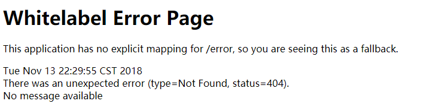

​	浏览器发送请求的请求头：

​	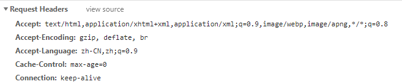

#### 	2、如果是其他客户端，默认响应一个json数据 

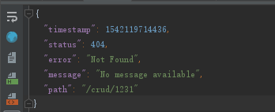

​	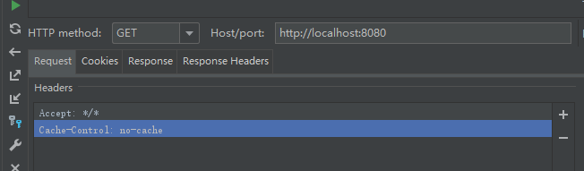

​	原理：

​		可以参考**ErrorMvcAutoConfiguration**，错误处理的自动配置

​		给容器中添加了以下组件：

​		1、DefaultErrorAttributes

```java
// 在页面共享信息   
public Map<String, Object> getErrorAttributes(RequestAttributes requestAttributes, boolean includeStackTrace) {
        Map<String, Object> errorAttributes = new LinkedHashMap();
        errorAttributes.put("timestamp", new Date());
        this.addStatus(errorAttributes, requestAttributes);
        this.addErrorDetails(errorAttributes, requestAttributes, includeStackTrace);
        this.addPath(errorAttributes, requestAttributes);
        return errorAttributes;
    }
```


​		2、BasicErrorController

```java
@Controller
@RequestMapping({"${server.error.path:${error.path:/error}}"})
public class BasicErrorController extends AbstractErrorController {
    @RequestMapping(
        produces = {"text/html"} // 产生html类型的数据,接收浏览器发送的请求
    )
    public ModelAndView errorHtml(HttpServletRequest request, HttpServletResponse response) {
        HttpStatus status = this.getStatus(request);
        Map<String, Object> model = Collections.unmodifiableMap(this.getErrorAttributes(request, this.isIncludeStackTrace(request, MediaType.TEXT_HTML)));
        response.setStatus(status.value());
        // 去哪个页面作为错误页面，包含页面地址和页面内容
        ModelAndView modelAndView = this.resolveErrorView(request, response, status, model);
        return modelAndView != null ? modelAndView : new ModelAndView("error", model);
    }

    @RequestMapping
    @ResponseBody // 产生json数据，接收其他客户端发送的请求
    public ResponseEntity<Map<String, Object>> error(HttpServletRequest request) {
        Map<String, Object> body = this.getErrorAttributes(request, this.isIncludeStackTrace(request, MediaType.ALL));
        HttpStatus status = this.getStatus(request);
        return new ResponseEntity(body, status);
    }
}
```


​		3、ErrorPageCustomizer

```java
// 系统出现错误以后来到error请求进行处理(web.xml注册的错误页面规则)
@Value("${error.path:/error}")
private String path = "/error";
```

​		4、DefaultErrorViewResolver

```java
 public ModelAndView resolveErrorView(HttpServletRequest request, HttpStatus status, Map<String, Object> model) {
        ModelAndView modelAndView = this.resolve(String.valueOf(status), model);
        if (modelAndView == null && SERIES_VIEWS.containsKey(status.series())) {
            modelAndView = this.resolve((String)SERIES_VIEWS.get(status.series()), model);
        }

        return modelAndView;
    }

    private ModelAndView resolve(String viewName, Map<String, Object> model) {
        // 默认SpringBoot可以去找到一个页面,error/404
        String errorViewName = "error/" + viewName;
        // 模板引擎可以解析这个页面地址就用模板引擎解析
        TemplateAvailabilityProvider provider = this.templateAvailabilityProviders.getProvider(errorViewName, this.applicationContext);
        // 模板引擎可用的情况下返回到errorViewName指定的视图地址
        return provider != null ? new ModelAndView(errorViewName, model) : 
        //模板引擎不可用，就在静态资源文件夹下找errorViewName对应的页面 error/404.html
        this.resolveResource(errorViewName, model);
    }

```

​		步骤：

​			一但系统出现4xx或者5xx之类的错误，ErrorPageCustomizer就会生效(定制错误响应规则 )，就会来到/error请求，就会被**BasicErrorController**处理

​		1、响应页面，去哪个页面是由**DefaultErrorViewResolver**解析得到的

```java
protected ModelAndView resolveErrorView(HttpServletRequest request, HttpServletResponse response, HttpStatus status, Map<String, Object> model) {
    	// 甩的的ErrorViewResolver得得到ModelAndView
        Iterator var5 = this.errorViewResolvers.iterator();

        ModelAndView modelAndView;
        do {
            if (!var5.hasNext()) {
                return null;
            }

            ErrorViewResolver resolver = (ErrorViewResolver)var5.next();
            modelAndView = resolver.resolveErrorView(request, status, model);
        } while(modelAndView == null);

        return modelAndView;
    }
```


### 2、如何定制错误响应

#### 	1、如何定制错误的页面

​		1、**有模板引擎的情况下，error/状态码.html**，【将错误页面命名为 错误状态码.html 放在模板引擎文件夹下的error文件夹下】，发生此状态码错误就会来到对应的页面

​		可以使用4xx和5xx作为错误页面的文件名来匹配这种类型的所有错误，精确优先(优先寻找精确的状态码页面.html)

​		页面获取的信息：

​			timestamp：时间戳

​			status：状态码

​			error：错误提示

​			exception：异常对象

​			message：异常消息

​			errors：JSR303数据校验的错误都在这里 

​		2、没有模板引擎(模板引擎下找不到这个错误页面)，在静态资源文件夹下找

​		3、以上都没有错误页面，就是默认来到SpringBoot默认的错误提示页面

#### 	2、如何定制错误的json数据

​		1、自定义异常处理&返回定制json数据

```java
public class UserNotExistException extends RuntimeException {
	public UserNotExistException() {
		super("用户不存在");
	}
}
```

```java
@ResponseBody
@ControllerAdvice
public class MyExceptionHander {
	// 浏览器客户端返回的都是json
	@ExceptionHandler(UserNotExistException.class)
	public Map<String, Object> handleException(Exception e) {
		Map<String, Object> map = new HashMap<String, Object>();
		map.put("code", "user.notexist");
		map.put("message", e.getMessage());
		return map;
	}
}
// 没有自适应效果
```

```java
@Controller
public class HelloController {
	@ResponseBody
	@RequestMapping("/hello")
	public String hello(@RequestParam("user") String user){
		if("aaa".equals(user)) {
			throw new UserNotExistException();
		}
		return "Hello World";
	}
}
```

http://localhost:8080/hello?user=aaa

2、转发到/error进行自适应响应处理

```java
@ControllerAdvice
public class MyExceptionHander {
	@ExceptionHandler(UserNotExistException.class)
	public String handleException(Exception e, HttpServletRequest request) {
		Map<String, Object> map = new HashMap<String, Object>();
		// 传入自己的错误状态码 4xx 5xx,否则就不会进入定制错误页面的解析流程
		//   Integer statusCode = (Integer)request.getAttribute("javax.servlet.error.status_code");
		request.setAttribute("javax.servlet.error.status_code",500);
		map.put("code", "user.notexist");
		map.put("message", e.getMessage());
		// 转发的/error
		return "forward:/error";
	}
}
```

#### 3、将定制数据携带出去

出现错误以后，会来到/error请求，会被BasicErrorController处理，响应出去可以获取的数据是由getErrorAttributes得到的(是AbstractErrorController(ErrorController)规定的方法)

1、完全来编写一个ErrorController的实现类【或者是编写AbstractErrorController的子类】，放在容器中

2、页面上能用的数据 ，或者是json返回能用的数据都是通过errorAttributes.getErrorAttributes得到的

​	容器中DefaultErrorAttributes默认进行数据处理的

自定义

```java
// 给容器中加入自定义的ErrorAttributes
@Component
public class MyErrorAttributes extends DefaultErrorAttributes {
	@Override
	public Map<String, Object> getErrorAttributes(RequestAttributes requestAttributes, boolean includeStackTrace) {
		Map<String, Object> map = super.getErrorAttributes(requestAttributes, includeStackTrace);
		map.put("company", "zzc");
		return map;
	}
}
```

最终的效果：响应是自适应的，可以通过定制ErrorAttributes改变需要返回的内容

# 8、配置嵌入式Servlet容器

SpringBoot默认是用的是嵌入式的Servlet容器(Tomcat)

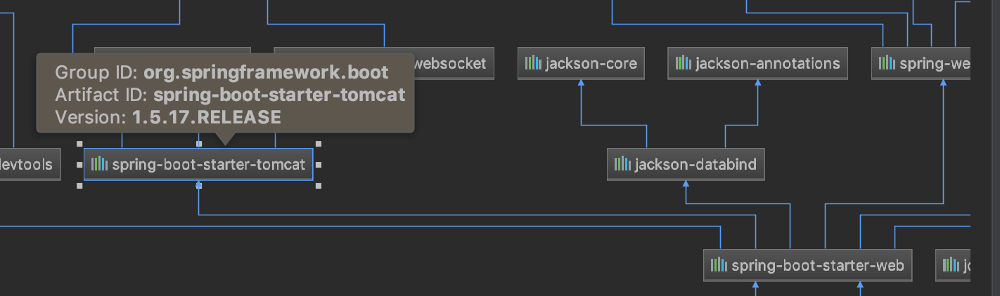

嵌入式Servlet容器自动配置原理：

```java
@AutoConfigureOrder(Ordered.HIGHEST_PRECEDENCE)
@Configuration
@ConditionalOnWebApplication
@Import(BeanPostProcessorsRegistrar.class)
// 导入了BeanPostProcessorsRegistrar：Spring注解版：给容器导入一些组件
// 导入了EmbeddedServletContainerCustomizerBeanPostProcessor
// 后置处理器：bean初始化前后(创建完对象，还没赋值)执行初始工作
public class EmbeddedServletContainerAutoConfiguration {

	/**
	 * Nested configuration if Tomcat is being used.
	 */
	@Configuration
	@ConditionalOnClass({ Servlet.class, Tomcat.class }) //判断当前是否引入了Tomcat依赖
	@ConditionalOnMissingBean(value = EmbeddedServletContainerFactory.class, search = SearchStrategy.CURRENT) // 判断当前容器中没有用户自己定义EmbeddedServletContainerFactory:嵌入式的Servlet容器工厂，作用：创建嵌入式的Servlet容器
	public static class EmbeddedTomcat {

		@Bean
		public TomcatEmbeddedServletContainerFactory tomcatEmbeddedServletContainerFactory() {
			return new TomcatEmbeddedServletContainerFactory();
		}

	}
}
```

1､EmbeddedServletContainerFactory(嵌入式Servlet容器工厂)

```java
public interface EmbeddedServletContainerFactory {

	// 获取嵌入式的Servlet容器
	EmbeddedServletContainer getEmbeddedServletContainer(
			ServletContextInitializer... initializers);

}
```

2､EmbeddedServletContainer(嵌入式的Servlet容器)

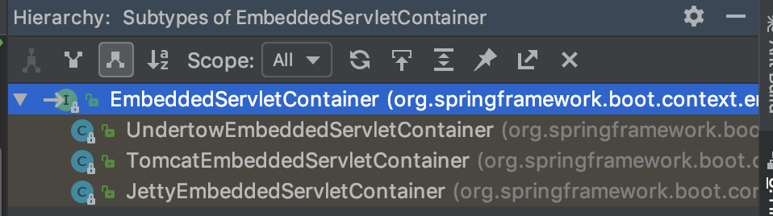

3､以TomcatEmbeddedServletContainerFactory为例

```java
	@Override
	public EmbeddedServletContainer getEmbeddedServletContainer(
			ServletContextInitializer... initializers) {
		// 创建一个Tomcat
        Tomcat tomcat = new Tomcat();
        // 配置tomcat的基本环境
		File baseDir = (this.baseDirectory != null) ? this.baseDirectory
				: createTempDir("tomcat");
		tomcat.setBaseDir(baseDir.getAbsolutePath());
		Connector connector = new Connector(this.protocol);
		tomcat.getService().addConnector(connector);
		customizeConnector(connector);
		tomcat.setConnector(connector);
		tomcat.getHost().setAutoDeploy(false);
		configureEngine(tomcat.getEngine());
		for (Connector additionalConnector : this.additionalTomcatConnectors) {
			tomcat.getService().addConnector(additionalConnector);
		}
		prepareContext(tomcat.getHost(), initializers);
        // 将配置好的tomcat传入进去
		return getTomcatEmbeddedServletContainer(tomcat);
	}
```

4､对嵌入式容器的配置修改是怎么生效的

问题？

### 1､如何定制和修改Servlet容器的相关配置

​	1､修改和server有关的配置(ServerProperties)

```properties
server.port=8081
server.context-path=/crud
# 通用的Servlet容器设置
server.xxx
# tomcat的设置
server.tomcat.xxx
```

​	2､编写一个EmbeddedServletContainerCustomizer：嵌入式的Servlet容器的定制器，来修改Servlet容器的配置

```java
@Configuration
public class MyServerConfig {

	@Bean
	public EmbeddedServletContainerCustomizer embeddedServletContainerCustomizer(){
		return new EmbeddedServletContainerCustomizer() {
			// 定制嵌入式的Servlet容器相关规则
			@Override
			public void customize(ConfigurableEmbeddedServletContainer container) {
				container.setPort(8081);
			}
		};
	}
}
```


### 2､SpringBoot能不能支持其他的Servlet容器

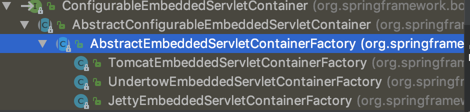

3､替换为其他嵌入式Servlet容器

默认支持:

Tomcat(默认支持)

```xml
<dependency>
    <groupId>org.springframework.boot</groupId>
    <artifactId>spring-boot-starter-web</artifactId>
    <!-- 引入web模块时默认依赖了spring-boot-starter-tomcat -->
</dependency>
```

Jetty

```xml
<dependency>
    <groupId>org.springframework.boot</groupId>
    <artifactId>spring-boot-starter-web</artifactId>
    <exclusions>
        <exclusion>
            <artifactId>spring-boot-starter-tomcat</artifactId>
            <groupId>org.springframework.boot</groupId>
        </exclusion>
    </exclusions>
</dependency>

<dependency>
    <groupId>org.springframework.boot</groupId>
    <artifactId>spring-boot-starter-jetty</artifactId>
</dependency>
```

Undertow

```xml
<dependency>
    <groupId>org.springframework.boot</groupId>
    <artifactId>spring-boot-starter-web</artifactId>
    <exclusions>
        <exclusion>
            <artifactId>spring-boot-starter-tomcat</artifactId>
            <groupId>org.springframework.boot</groupId>
        </exclusion>
    </exclusions>
</dependency>

<dependency>
    <groupId>org.springframework.boot</groupId>
    <artifactId>spring-boot-starter-undertow</artifactId>
</dependency>
```

### 3､嵌入式Servlet容器自动配置原理

EmbeddedServletContainerAutoConfiguration：嵌入式的Servlet容器自动配置

```java
@AutoConfigureOrder(Ordered.HIGHEST_PRECEDENCE)
@Configuration
@ConditionalOnWebApplication
@Import(BeanPostProcessorsRegistrar.class) 
// 导入BeanPostProcessorsRegistrar：Spring注解版，给容器中导入一些组件
// 导入了EmbeddedServletContainerCustomizerBeanPostProcessor：后置处理器：bean初始化前后(创建完对象，还没属性赋值)执行初始化工作
public class EmbeddedServletContainerAutoConfiguration {
    @Configuration
	@ConditionalOnClass({ Servlet.class, Tomcat.class }) // 判断当前是否引入了Tomcat依赖
	@ConditionalOnMissingBean(value = EmbeddedServletContainerFactory.class, search = SearchStrategy.CURRENT) // 判断当前容器没有用户自己定义EmbeddedServletContainerFactory：嵌入式容器工厂，作用：创建嵌入式的Servlet容器
	public static class EmbeddedTomcat {

		@Bean
		public TomcatEmbeddedServletContainerFactory tomcatEmbeddedServletContainerFactory() {
			return new TomcatEmbeddedServletContainerFactory();
		}

	}
    
    /**
	 * Nested configuration if Jetty is being used.
	 */
	@Configuration
	@ConditionalOnClass({ Servlet.class, Server.class, Loader.class,
			WebAppContext.class })
	@ConditionalOnMissingBean(value = EmbeddedServletContainerFactory.class, search = SearchStrategy.CURRENT)
	public static class EmbeddedJetty {

		@Bean
		public JettyEmbeddedServletContainerFactory jettyEmbeddedServletContainerFactory() {
			return new JettyEmbeddedServletContainerFactory();
		}

	}

	/**
	 * Nested configuration if Undertow is being used.
	 */
	@Configuration
	@ConditionalOnClass({ Servlet.class, Undertow.class, SslClientAuthMode.class })
	@ConditionalOnMissingBean(value = EmbeddedServletContainerFactory.class, search = SearchStrategy.CURRENT)
	public static class EmbeddedUndertow {

		@Bean
		public UndertowEmbeddedServletContainerFactory undertowEmbeddedServletContainerFactory() {
			return new UndertowEmbeddedServletContainerFactory();
		}

	}
}
```

#### 1､EmbeddedServletContainerFactory(嵌入式Servlet容器工厂)

```java
public interface EmbeddedServletContainerFactory {

    // 获取嵌入式的Servlet容器
	EmbeddedServletContainer getEmbeddedServletContainer(
			ServletContextInitializer... initializers);

}
```

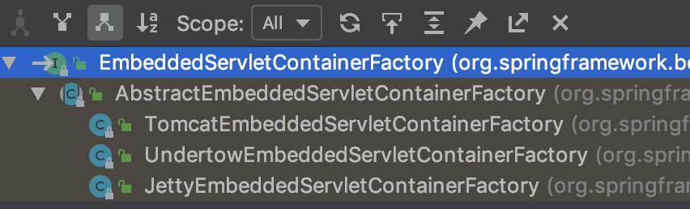

#### 2､EmbeddedServletContainer(嵌入式Servlet容器)

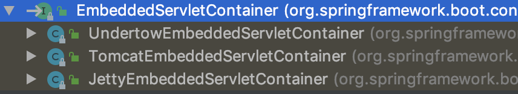

#### 3､以TomcatEmbeddedServletContainerFactory为例

```java
@Override
public EmbeddedServletContainer getEmbeddedServletContainer(ServletContextInitializer... initializers) {
    // 创建一个Tomcat
    Tomcat tomcat = new Tomcat();
    // 配置Tomcat的基本环境
    File baseDir = (this.baseDirectory != null) ? this.baseDirectory
        : createTempDir("tomcat");
    tomcat.setBaseDir(baseDir.getAbsolutePath());
    Connector connector = new Connector(this.protocol);
    tomcat.getService().addConnector(connector);
    customizeConnector(connector);
    tomcat.setConnector(connector);
    tomcat.getHost().setAutoDeploy(false);
    configureEngine(tomcat.getEngine());
    for (Connector additionalConnector : this.additionalTomcatConnectors) {
        tomcat.getService().addConnector(additionalConnector);
    }
    prepareContext(tomcat.getHost(), initializers);
    // 将配置好的Tomcat传入进去，返回一个EmbeddedServletContainer,并启动Tomcat服务器
    return getTomcatEmbeddedServletContainer(tomcat);
}
```

#### 4､对嵌入式容器的配置修改

1､ServerProperties、EmbeddedServletContainerCustomizer

**EmbeddedServletContainerCustomizer**：定制器修改了Servlet容器的配置

#### 5､容器中导入了EmbeddedServletContainerCustomizerBeanPostProcessor

```java
// 在初始化之前
@Override
public Object postProcessBeforeInitialization(Object bean, String beanName)
    throws BeansException {
    // 如果当前初始化的是一个ConfigurableEmbeddedServletContainer类型的组件
    if (bean instanceof ConfigurableEmbeddedServletContainer) {
        postProcessBeforeInitialization((ConfigurableEmbeddedServletContainer) bean);
    }
    return bean;
}

private void postProcessBeforeInitialization(
    ConfigurableEmbeddedServletContainer bean) {
    // 获取所有的定制器，调用每一个定制器customize()方法来给Servlet容器属性赋值
    for (EmbeddedServletContainerCustomizer customizer : getCustomizers()) {
        customizer.customize(bean);
    }
}

private Collection<EmbeddedServletContainerCustomizer> getCustomizers() {
    if (this.customizers == null) {
        // Look up does not include the parent context
        this.customizers = new ArrayList<EmbeddedServletContainerCustomizer>(
            this.beanFactory
            // 从容器中获取EmbeddedServletContainerCustomizer类型的组件
            // 定制Servlet容器，给容器中可以添加一个EmbeddedServletContainerCustomizer类型的组件
            .getBeansOfType(EmbeddedServletContainerCustomizer.class,
                            false, false)
            .values());
        Collections.sort(this.customizers, AnnotationAwareOrderComparator.INSTANCE);
        this.customizers = Collections.unmodifiableList(this.customizers);
    }
    return this.customizers;
}
// ServerProperties也是定制器
```

步骤：

​	1､SpringBoot根据导入的依赖情况，给容器中添加相应的EmbeddedServletContainerFactory【TomcatEmbeddedServletContainerFactory】

​	2､容器中某个组件要创建对象就会惊动后置处理器(EmbeddedServletContainerCustomizerBeanPostProcessor)，只要是嵌入式的Servlet容器工厂，后轩处理器就工作

​	3､后置处理器，从容器中获取所有的EmbeddedServletContainerCustomizer(嵌入式Servlet容器的定制器)，调用定制器的定制方法

### 4､嵌入式Servlet容器启动原理

什么时候创建嵌入式的Servlet容器工厂？什么时候获取嵌入式的Servlet容器并启动Tomcat服务

获取嵌入式的Servlet容器工厂：

​	1､SpringBoot应用启动运行run方法

​	2､refreshContext(context);SpringBoot刷新IOC容器(创建IOC容器对象，并初始化容器，创建容器中的每一个组件)，如果是WEB应用创建**AnnotationConfigEmbeddedWebApplicationContext**，否则创建默认的IOC容器**AnnotationConfigApplicationContext**

​	3､refreshContext(context);刷新刚才创建好的IOC容器

```java
@Override
public void refresh() throws BeansException, IllegalStateException {
    synchronized (this.startupShutdownMonitor) {
        // Prepare this context for refreshing.
        prepareRefresh();

        // Tell the subclass to refresh the internal bean factory.
        ConfigurableListableBeanFactory beanFactory = obtainFreshBeanFactory();

        // Prepare the bean factory for use in this context.
        prepareBeanFactory(beanFactory);

        try {
            // Allows post-processing of the bean factory in context subclasses.
            postProcessBeanFactory(beanFactory);

            // Invoke factory processors registered as beans in the context.
            invokeBeanFactoryPostProcessors(beanFactory);

            // Register bean processors that intercept bean creation.
            registerBeanPostProcessors(beanFactory);

            // Initialize message source for this context.
            initMessageSource();

            // Initialize event multicaster for this context.
            initApplicationEventMulticaster();

            // Initialize other special beans in specific context subclasses.
            onRefresh();

            // Check for listener beans and register them.
            registerListeners();

            // Instantiate all remaining (non-lazy-init) singletons.
            finishBeanFactoryInitialization(beanFactory);

            // Last step: publish corresponding event.
            finishRefresh();
        }

        catch (BeansException ex) {
            if (logger.isWarnEnabled()) {
                logger.warn("Exception encountered during context initialization - " +
                            "cancelling refresh attempt: " + ex);
            }

            // Destroy already created singletons to avoid dangling resources.
            destroyBeans();

            // Reset 'active' flag.
            cancelRefresh(ex);

            // Propagate exception to caller.
            throw ex;
        }

        finally {
            // Reset common introspection caches in Spring's core, since we
            // might not ever need metadata for singleton beans anymore...
            resetCommonCaches();
        }
    }
}
```

​	4､onRefresh();WEB的IOC容器重写了onRefresh方法

​	5､WEB IOC容器会创建嵌入式的Servlet容器；**createEmbeddedServletContainer();**

​	6､获取嵌入式的Servlet容器工厂

EmbeddedServletContainerFactory containerFactory = getEmbeddedServletContainerFactory();

​	从IOC容器中获取EmbeddedServletContainerFactory组件，**TomcatEmbeddedServletContainerFactory**创建对象，后置处理器一个是这个对象，就获取所有的定制器来先定制Servlet容器的相关配置

​	7､**使用容器工厂获取嵌入式的Servlet容器**：

this.embeddedServletContainer = containerFactory.getEmbeddedServletContainer(getSelfInitializer());

​	8､嵌入式的Servlet容器创建对象并启动Servlet容器；**先启动嵌入式的Servlet容器，再将IOC容器中剩下没有创建出的对象获取出来**

IOC容器启动创建嵌入式的Servlet容器

# 9､注册Servlet、Filter和Listener【代码和注解两种方式】

由于SpringBoot默认是以jar包的方式启动嵌入式的Servlet容器来启动SpringBoot的web应用，没有web.xml文件。

故而采用其他方式来注册三大组件：代码注册和注解注册。

### 1､ServletRegistrationBean注册Servlet

```java
public class Myservlet extends HttpServlet {

	@Override
	protected void doGet(HttpServletRequest req, HttpServletResponse resp) throws ServletException, IOException {
		this.doPost(req, resp);
	}

	@Override
	protected void doPost(HttpServletRequest req, HttpServletResponse resp) throws ServletException, IOException {
		resp.getWriter().write("Hello Servlet");
	}
}
```

```java
@Configuration
public class MyServerConfig {

	// 注册Servlet
	@Bean
	public ServletRegistrationBean myServlet() {
		ServletRegistrationBean registrationBean = new ServletRegistrationBean(new Myservlet(), "/myServlet");
		return registrationBean;
	}
}
```

注解版(@ServletComponentScan，该注解会自动扫描对应包下面的Servlet类，默认是启动类所在的包):

```java
@WebServlet(urlPatterns = {"/myServlet"})
public class MyServlet extends HttpServlet {

	@Override
	protected void doGet(HttpServletRequest req, HttpServletResponse resp) throws ServletException, IOException {
		this.doPost(req, resp);
	}

	@Override
	protected void doPost(HttpServletRequest req, HttpServletResponse resp) throws ServletException, IOException {
		resp.getWriter().write("Hello Servlet");
	}
}
```

```java
@SpringBootApplication
@ServletComponentScan
public class Application {

	public static void main(String[] args) {
		SpringApplication.run(Application.class, args);
	}
}
```

### 2､FilterRegistrationBean注册Filter

```java
public class MyFilter implements Filter {

	@Override
	public void init(FilterConfig filterConfig) throws ServletException {

	}

	@Override
	public void doFilter(ServletRequest request, ServletResponse response, FilterChain chain) throws IOException, ServletException {
		System.out.println("MyFilter process...");
		chain.doFilter(request, response);
	}

	@Override
	public void destroy() {

	}
}
```

```java
@Configuration
public class MyServerConfig {

	// 注册Filter
	@Bean
	public FilterRegistrationBean myFilter() {
		FilterRegistrationBean registrationBean = new FilterRegistrationBean();
		registrationBean.setFilter(new MyFilter());
		registrationBean.setUrlPatterns(Arrays.asList("/hello", "/myServlet"));
		return registrationBean;
	}
}
```

注解版：

```java
@WebFilter(urlPatterns = {"/*"})
public class MyFilter implements Filter {

	@Override
	public void init(FilterConfig filterConfig) throws ServletException {

	}

	@Override
	public void doFilter(ServletRequest request, ServletResponse response, FilterChain chain) throws IOException, ServletException {
		System.out.println("MyFilter process...");
		chain.doFilter(request, response);
	}

	@Override
	public void destroy() {

	}
}
```

```java
@SpringBootApplication
@ServletComponentScan
public class Application {

	public static void main(String[] args) {
		SpringApplication.run(Application.class, args);
	}
}
```


### 3､ServletListenerRegistrationBean注册Listener

```java
public class MyListener implements ServletContextListener {
	@Override
	public void contextInitialized(ServletContextEvent sce) {
		System.out.println("contextInitialized...web应用启动");
	}

	@Override
	public void contextDestroyed(ServletContextEvent sce) {
		System.out.println("contextDestroyed...当前web项目销毁");
	}
}
```

```java
@Configuration
public class MyServerConfig {

	// 注册Listener
	@Bean
	public ServletListenerRegistrationBean myListener(){
		ServletListenerRegistrationBean<MyListener> registrationBean = new ServletListenerRegistrationBean<>(new MyListener());
		return registrationBean;
	}
}
```

注解版：

```java
@WebListener
public class MyListener implements ServletContextListener {
	@Override
	public void contextInitialized(ServletContextEvent sce) {
		System.out.println("contextInitialized...web应用启动");
	}

	@Override
	public void contextDestroyed(ServletContextEvent sce) {
		System.out.println("contextDestroyed...当前web项目销毁");
	}
}
```

```java
@SpringBootApplication
@ServletComponentScan
public class Application {

	public static void main(String[] args) {
		SpringApplication.run(Application.class, args);
	}
}
```

