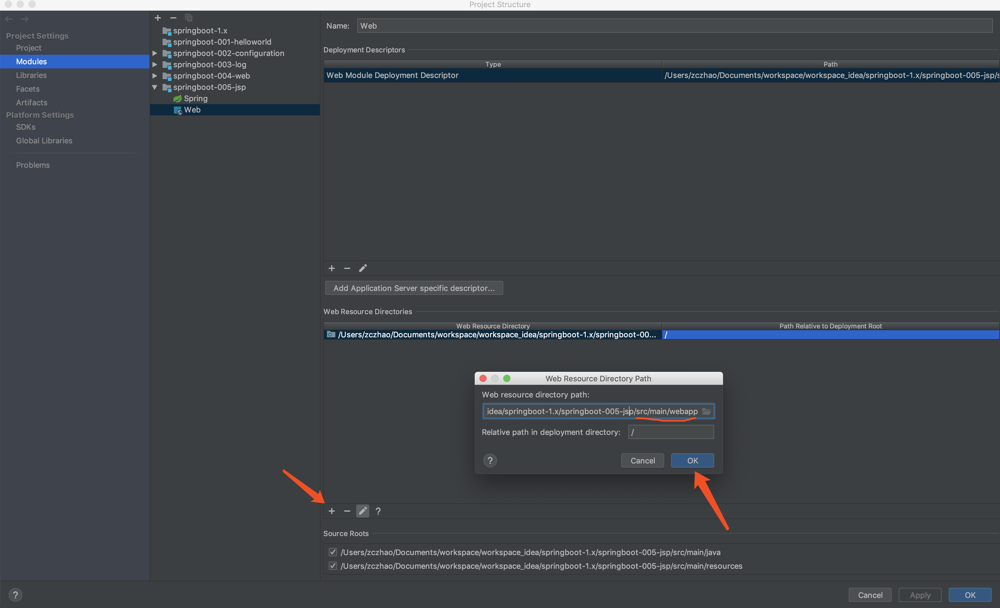
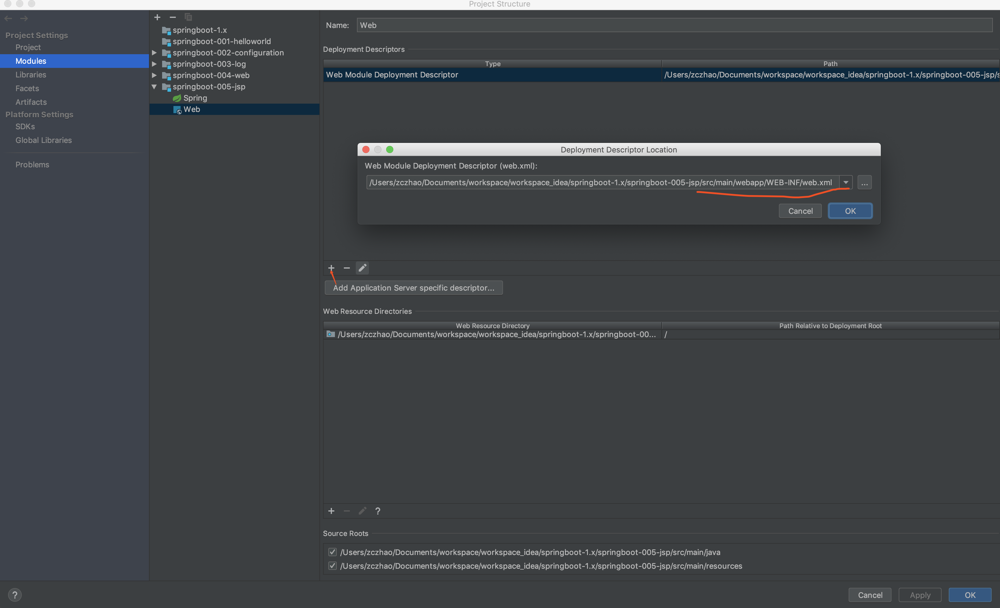

配置嵌入式Servlet容器

1､ConfigurableEmbeddedServletContainer

2､EmbeddedServletContainerCustomizer

3､注册Servlet、Filter、Listener

ServletRegistrationBean

FilterRegistrationBean

ServletListenerRegistrationBean

4、使用其他Servlet容器Jetty(长连接)、Undertow(不支持JSP)

# 使用外置的Servlet容器

嵌入式Servlet容器：

​	优点：简单、便携

​	缺点：默认不支持JSP、优化定制比较复杂(使用定制器(ServerProPerties自定义EmbeddedServletContainerCustomizer)，自已编写嵌入式Servlet的容器的创建工厂[EmbeddedServletContainerFactory])

外置的Servlet容器：外面安装Tomcat—应用以war包的方式打包

idea创建war项目没有webapp目录和web.xml文件

Project Structure->Project Settings->Modules->选择需要生成webapp目录和web.xml文件的项目->Web

生成webapp目录



生成web.xml



步骤：

​	1､必须创建一个war项目(利用idea创建好目录结构)

```xml
<packaging>war</packaging>
```

​	2､将嵌入式的Tomcat指定为provided

```xml
<!-- 使用外部Tomcat容器，嵌入式的Tomcat scope指定为provided -->
<dependency>
    <groupId>org.springframework.boot</groupId>
    <artifactId>spring-boot-starter-tomcat</artifactId>
    <scope>provided</scope>
</dependency>
```

​	3､必须编写一个SpringBootServletInitializer的子类，并调用configure方法

```java
package zzc.springboot;

import org.springframework.boot.builder.SpringApplicationBuilder;
import org.springframework.boot.web.support.SpringBootServletInitializer;

public class ServletInitializer extends SpringBootServletInitializer {

	@Override
	protected SpringApplicationBuilder configure(SpringApplicationBuilder builder) {
        // 传入SpringBoot应用的主程序
		return builder.sources(Application.class);
	}
}
```

```java
package zzc.springboot;

import org.springframework.boot.SpringApplication;
import org.springframework.boot.autoconfigure.SpringBootApplication;

@SpringBootApplication
public class Application {

	public static void main(String[] args) {
		SpringApplication.run(Application.class, args);
	}
}
```

合并为一个类：

```java
package zzc.springboot;

import org.springframework.boot.SpringApplication;
import org.springframework.boot.autoconfigure.SpringBootApplication;
import org.springframework.boot.builder.SpringApplicationBuilder;
import org.springframework.boot.web.support.SpringBootServletInitializer;

@SpringBootApplication
public class Application extends SpringBootServletInitializer {

    @Override
	protected SpringApplicationBuilder configure(SpringApplicationBuilder builder) {
		return builder.sources(Application.class);
	}
    
	public static void main(String[] args) {
		SpringApplication.run(Application.class, args);
	}
}
```

​	4､启动外部Tomcat服务器就可以使用

使用外部Serlvet容器

1､SpringBootServletInitializer

​	重写configure

2､SpringApplicationBuilder

​	builder.sources(@SpringBootApplication类);

3､启动原理

​	Servlet3.0标准ServletContainerInitializer扫描所有jar包中META-INF/services/javax.servlet.ServletContainerInitializer文件指定的类并加载

​	加载spring web包下的SpringServletContainerInitializer

​	扫描@HandleType(WebApplicationInitializer)

​	加载SpringBootServletContainerInitializer并运行onStartup方法

​	加载@SpringBootApplication主类，启动容器等

```java
 protected WebApplicationContext createRootApplicationContext(ServletContext servletContext) {
     	// 1､创建SpringApplicationBuilder
        SpringApplicationBuilder builder = this.createSpringApplicationBuilder();
        builder.main(this.getClass());
        ApplicationContext parent = this.getExistingRootWebApplicationContext(servletContext);
        if (parent != null) {
            this.logger.info("Root context already created (using as parent).");
            servletContext.setAttribute(WebApplicationContext.ROOT_WEB_APPLICATION_CONTEXT_ATTRIBUTE, (Object)null);
            builder.initializers(new ApplicationContextInitializer[]{new ParentContextApplicationContextInitializer(parent)});
        }

        builder.initializers(new ApplicationContextInitializer[]{new ServletContextApplicationContextInitializer(servletContext)});
        builder.contextClass(AnnotationConfigEmbeddedWebApplicationContext.class);
     	// 调用configure方法，子类重写了这个方法，将SpringBoot主程序类传入了进来
        builder = this.configure(builder);
        builder.listeners(new ApplicationListener[]{new SpringBootServletInitializer.WebEnvironmentPropertySourceInitializer(servletContext)});
     	// 使用builder创建一个Spring应用
        SpringApplication application = builder.build();
        if (application.getSources().isEmpty() && AnnotationUtils.findAnnotation(this.getClass(), Configuration.class) != null) {
            application.getSources().add(this.getClass());
        }

        Assert.state(!application.getSources().isEmpty(), "No SpringApplication sources have been defined. Either override the configure method or add an @Configuration annotation");
        if (this.registerErrorPageFilter) {
            application.getSources().add(ErrorPageFilterConfiguration.class);
        }
		// 启动Spring应用
        return this.run(application);
    }
```

