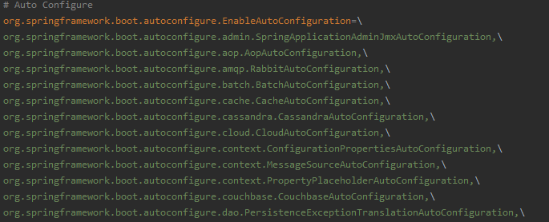

# Spring Boot自定义starters

## 1、自定义starters

- 自动装配Bean
  自动装配使用配置类(@Configuration)结合Spring4提供的条件判断注释@Conditional及Spring Boot的派生注解如@ConditionOnClass完成
- 配置自动装配Bean
  将标注@Configuration的自动配置类，放在classpath下META-INF/spring.factories文件中，如
  
- 启动器(starter)
  启动器模块是一个空JAR文件，仅提供辅助性依赖管理，这些依赖可能用于自动装配或其他类库
  命名规约：
      推荐使用以下命令规约
      官方命名空间
         前缀：spring-boot-starter-
         模式：spring-boot-starter-模式名
         举例：spring-boot-starter-web，spring-boot-starter-actuator，spring-boot-starter-jdbc
      自定义命名空间
         前缀：-spring-boot-starter
         模式：模块-spring-boot-starter
         举例：mybatis-spring-boot-starter

starter：

1、这个场景需要使用到的依赖是什么？

2、如何编写自动配置

```java
@Configuration // 指定这个类是一个配置类
@ConditionalOnXXX // 在指定条件成立的情况下自动配置类生效
@AutoConfigureAfter // 指定自动配置类的顺序
@Bean // 给容器中添加组件

@ConfigurationProperties // 结合相关xxxProperties类来绑定相关的配置
@EnableConfigurationProperties // 让xxxProperties生效加入到容器中

// 自动配置类要能加载
// 将需要启动就加载的自动配置类，配置在META-INF/spring.factories
# Auto Configure
org.springframework.boot.autoconfigure.EnableAutoConfiguration=\
org.springframework.boot.autoconfigure.admin.SpringApplicationAdminJmxAutoConfiguration,\
org.springframework.boot.autoconfigure.aop.AopAutoConfiguration,\
org.springframework.boot.autoconfigure.amqp.RabbitAutoConfiguration
```

3、模式

启动器只用来做依赖导入，专门来写一个自动配置模块，启动器依赖自动配置，别人只需要引入启动器(starter)

mybatis-spring-boot-starter：自定义启动器名-spring-boot-starter

## 